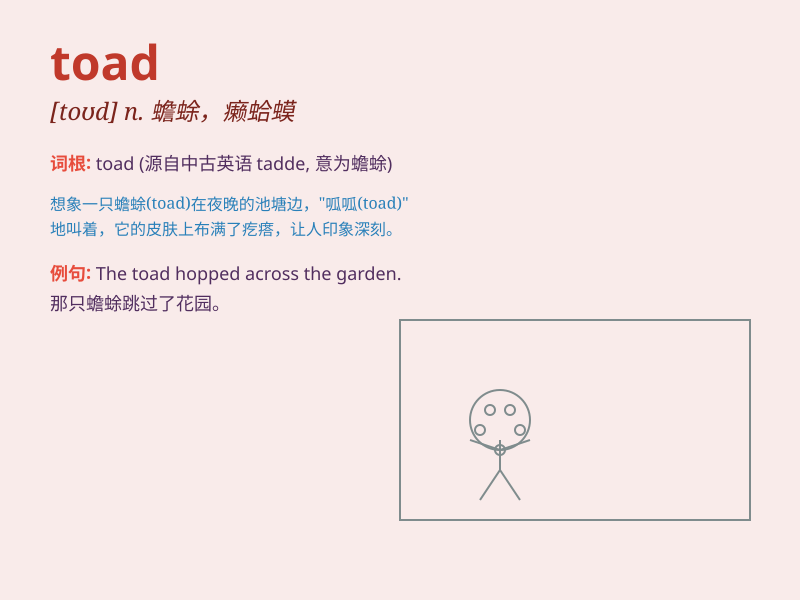

## toad

**英音:** _[təʊd]_ **美音:** _[tod]_

**译义:** *n.[动]蟾蜍,癞蛤蟆,讨厌的家伙*

### 短语

+ **common toad:** _普通蟾蜍_

+ **toad in the hole:** _裹有面糊的烤香肠_

+ **poisonous toad:** _有毒的蟾蜍_

+ **garden toad:** _花园蟾蜍_

+ **spotted toad:** _斑点蟾蜍_

### 例句

#### 例句1

> **The toad hopped across the garden.**

**中文翻译:** 这只蟾蜍跳过了花园。

**单词释义:** 蟾蜍

#### 例句2

> **She was frightened when she saw the big toad.**

**中文翻译:** 当她看到那只大蟾蜍时，她被吓到了。

**单词释义:** 蟾蜍

#### 例句3

> **The toad sat motionless under the leaf.**

**中文翻译:** 这只蟾蜍一动不动地坐在叶子下面。

**单词释义:** 蟾蜍

### 背诵小故事

> Once upon a time, a little frog was lost in a big forest. It met a
friendly bird who said, \'You look like a toad.\' The frog was confused
and asked, \'What\'s a toad?\' The bird explained that a toad is a kind
of creature like you but with a bumpy skin.

**从前，一只小青蛙在大森林里迷路了。它遇到一只友好的鸟，鸟说：'你看起来像一只蟾蜍。'青蛙很困惑，问：'什么是蟾蜍？'鸟解释说，蟾蜍是一种像你但皮肤有疙瘩的生物。**

### 图义

