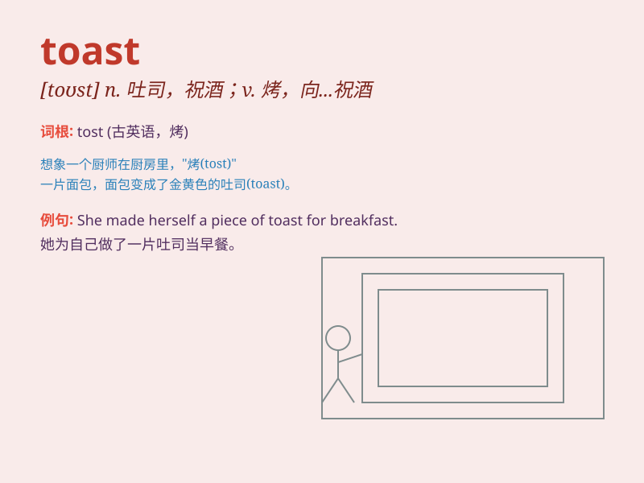

## toast

**英音:** _[təʊst]_ **美音:** _[tost]_

**译义:**
*n.烤面包(片),吐司面包,干杯vt.敬酒,烤(面包等),使暖和vi.烤暖,烤火,烘*

### 短语

+ **make toast:** _制作烤面包片_

+ **buttered toast:** _涂了黄油的烤面包片_

+ **toast the bride and groom:** _为新娘新郎祝酒_

+ **dry toast:** _干烤面包片_

+ **toast bread:** _烤面包_

### 例句

#### 例句1

> **She toasted the bread in the oven.**

**中文翻译:** 她在烤箱里烤面包。

**单词释义:** 烤（面包等）

#### 例句2

> **Let\'s raise our glasses and toast to our friendship.**

**中文翻译:** 让我们举起酒杯，为我们的友谊干杯。

**单词释义:** 为\...干杯

#### 例句3

> **He was toasted by his colleagues for his promotion.**

**中文翻译:** 他因升职受到同事们的祝贺。

**单词释义:** 向\...敬酒；祝贺

### 背诵小故事

>
在寒冷的冬日，一家人围坐在壁炉旁。爸爸烤好了面包片，将其放在盘子里，然后高高举起，笑着说：'这是美味的
toast（烤面包片），能温暖我们的胃。'大家开心地享用着。

**在寒冷的冬日，一家人围坐，爸爸展示烤好的面包片并称之为
toast（烤面包片），大家享用。**

### 图义

