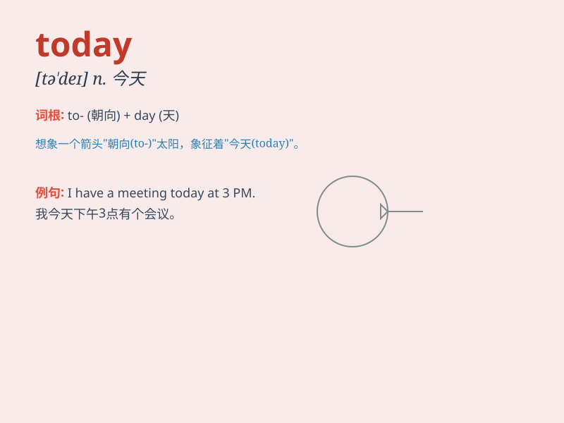

## today

**英音:** _[tə\'deɪ]_ **美音:** _[tə\'de]_

**译义:** *adv.今天,现今n.今天,现今*

### 短语

+ **today\'s newspaper:** _今天的报纸_

+ **from today:** _从今天起_

+ **up to today:** _直到今天_

+ **today and tomorrow:** _今天和明天_

+ **for today:** _为了今天_

### 例句

#### 例句1

> **Today is a sunny day.**

**中文翻译:** 今天是个晴天。

**单词释义:** 今天

#### 例句2

> **I have a lot of work to do today.**

**中文翻译:** 我今天有很多工作要做。

**单词释义:** 今天

#### 例句3

> **She looks very happy today.**

**中文翻译:** 她今天看起来很开心。

**单词释义:** 今天

### 背诵小故事

>
想象一下，你早上醒来，阳光透过窗户照进来。你看了看日历，惊喜地发现今天（today）没有工作安排，是完全属于自己的放松日，可以尽情做喜欢的事。

**想象你醒来后发现今天没有工作安排，是放松的一天，以此来记住'today'表示今天。**

### 图义

