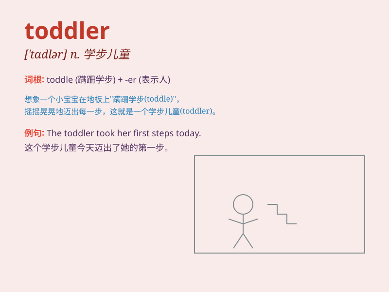

## toddler

**英音:** _[\'tɒdlə]_ **美音:** _[\'tɑdlɚ]_

**译义:** *n.初学走路的孩子*

### 短语

+ **toddler years:** _幼儿时期_

+ **toddler stage:** _学步阶段_

+ **toddler group:** _幼儿组_

+ **toddler play:** _幼儿游戏_

+ **toddler care:** _幼儿护理_

### 例句

#### 例句1

> **The toddler is learning to walk.**

**中文翻译:** 这个幼儿正在学习走路。

**单词释义:** 幼儿

#### 例句2

> **The toddler was playing with toys in the corner.**

**中文翻译:** 这个幼儿在角落里玩玩具。

**单词释义:** 幼儿

#### 例句3

> **The tired toddler fell asleep quickly.**

**中文翻译:** 这个疲倦的幼儿很快就睡着了。

**单词释义:** 幼儿

### 背诵小故事

> A toddler was playing in the garden. He toddled around, sometimes
falling but always getting up with a smile. His unsteady steps and
curious eyes made him so cute. Remember, a toddler is a young child
learning to walk and explore.

**一个幼儿正在花园里玩耍。他蹒跚地走来走去，有时会摔倒，但总是笑着站起来。他不稳的脚步和好奇的眼睛让他十分可爱。记住，toddler
就是正在学走路和探索的幼童。**

### 图义

