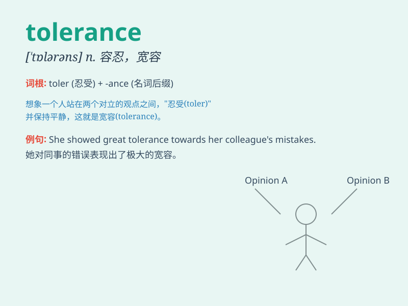

## tolerance

**英音:** _[\'tɒl(ə)r(ə)ns]_ **美音:** _[\'tɑlərəns]_

**译义:**
*n.公差,宽容,忍受,容忍,(食物中残存杀虫剂的)(法定)容许量vt.给(机器部件等)规定公差*

### 短语

+ **tolerance limit:** _容限；公差极限_

+ **fault tolerance:** _容错；故障容限_

+ **drug tolerance:** _耐药性；药物耐受性_

+ **glucose tolerance:** _葡萄糖耐量_

+ **tolerance range:** _公差范围；容差范围_

### 例句

#### 例句1

> **His tolerance for spicy food is very high.**

**中文翻译:** 他对辛辣食物的耐受性非常高。

**单词释义:** 耐受性；忍受程度

#### 例句2

> **We need to show more tolerance towards people with different
opinions.**

**中文翻译:** 我们需要对持有不同意见的人表现出更多的宽容。

**单词释义:** 宽容；容忍

#### 例句3

> **The machine has a high tolerance for temperature variations.**

**中文翻译:** 这台机器对温度变化有很高的容忍度。

**单词释义:** 容忍度；公差

### 背诵小故事

> Once upon a time, in a diverse village, people had tolerance for each
other\'s differences. They understood and accepted different cultures
and habits. This made the village peaceful and harmonious. Tolerance
means the ability to accept and respect differences.

**从前，在一个多元化的村庄里，人们相互包容彼此的差异。他们理解并接受不同的文化和习惯。这使得村庄和平且和谐。tolerance
意思是容忍；宽容；忍受；包容**

### 图义

