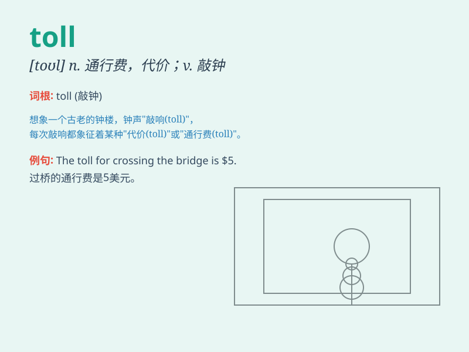

## toll

**英音:** _[təʊl]_ **美音:** _[tol]_

**译义:**
*n.通行税(费),费,代价,钟声vt.征收,敲钟,鸣(钟)(特指宣布死亡),勾引,引诱vi.征税,鸣钟*

### 短语

+ **toll road:** _收费公路_

+ **toll booth:** _收费亭_

+ **toll bridge:** _收费桥_

+ **take a heavy toll:** _造成重大损失_

+ **death toll:** _死亡人数_

### 例句

#### 例句1

> **The toll of the accident was three deaths and several
injuries.**

**中文翻译:** 这次事故的代价是三人死亡和数人受伤。

**单词释义:** （事故、灾难等的）伤亡人数

#### 例句2

> **You have to pay a toll to cross the bridge.**

**中文翻译:** 你过桥得交过桥费。

**单词释义:** （道路、桥梁的）通行费

#### 例句3

> **The war took a heavy toll on the country\'s economy.**

**中文翻译:** 战争给这个国家的经济带来了沉重的损失。

**单词释义:** 损失；破坏；造成的恶果

### 背诵小故事

> A brave knight had to cross a dangerous bridge. To pass, he had to
pay a toll. But he had no money. So, he fought the guards and finally
crossed without paying the toll. Remember, toll means a charge for using
something.

**一位勇敢的骑士要穿过一座危险的桥。要过桥，他得交过桥费。但他没钱。于是，他和守卫打了起来，最终没交过桥费就过去了。记住，toll
意思是使用某物的费用。**

### 图义

