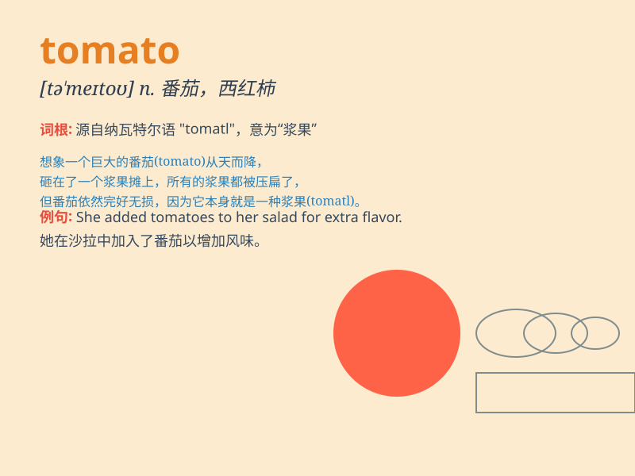

## tomato

**英音:** _[tə\'mɑːtəʊ]_ **美音:** _[tə\'meto]_

**译义:** *n.番茄,西红柿*

### 短语

+ **tomato sauce:** _番茄酱_

+ **tomato soup:** _番茄汤_

+ **tomato juice:** _番茄汁_

+ **cherry tomato:** _樱桃番茄_

+ **tomato plant:** _番茄植株_

### 例句

#### 例句1

> **I need to buy some tomatoes for the salad.**

**中文翻译:** 我需要为沙拉买一些西红柿。

**单词释义:** 西红柿（复数形式）

#### 例句2

> **The tomato sauce on the pizza is delicious.**

**中文翻译:** 披萨上的番茄酱很美味。

**单词释义:** 西红柿（这里指做成酱的西红柿）

#### 例句3

> **She planted tomatoes in her garden.**

**中文翻译:** 她在她的花园里种了西红柿。

**单词释义:** 西红柿（复数形式）

### 背诵小故事

> A little monkey went to the farm and saw many red tomato. He was very
happy and picked one to eat. It was so sweet and juicy. The monkey
decided to take some home for his friends.

**一只小猴子去农场，看到了好多红色的西红柿。他非常高兴，摘了一个吃。它又甜又多汁。猴子决定带一些回家给他的朋友们。**

### 图义

