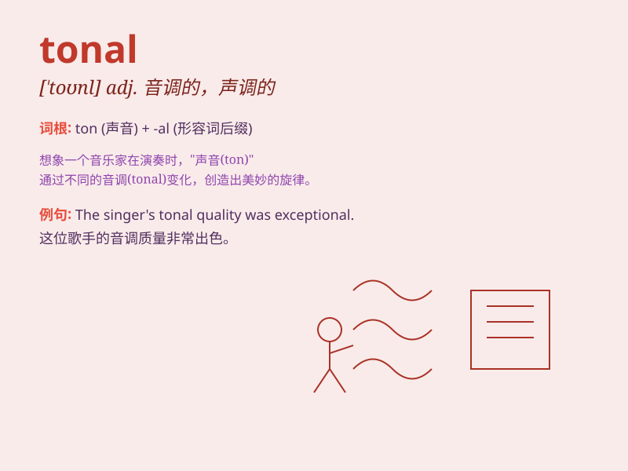

## tonal

**英音:** _[\'təʊn(ə)l]_ **美音:** _[\'tonl]_

**译义:** *adj.音调的*

### 短语

+ **tonal quality:** _音调质量；音色_

+ **tonal range:** _音域；色调范围_

+ **tonal center:** _主音；音调中心_

+ **tonal harmony:** _调性和谐；色调和谐_

+ **tonal language:** _声调语言_

### 例句

#### 例句1

> **The tonal quality of the piano was excellent.**

**中文翻译:** 这架钢琴的音调质量非常出色。

**单词释义:** 音调的；色调的

#### 例句2

> **She has a good sense of tonal contrast in her paintings.**

**中文翻译:** 她在她的画作中对色调对比有很好的感觉。

**单词释义:** 色调的

#### 例句3

> **The tonal range of his singing voice is very wide.**

**中文翻译:** 他唱歌的音域非常宽。

**单词释义:** 音调的

### 背诵小故事

> A painter was trying to create a tonal masterpiece. He mixed colors
carefully to achieve the perfect harmony of tones. Finally, his tonal
painting was highly praised.

**一位画家试图创作一幅色调的杰作。他仔细混合颜色以达到色调的完美和谐。最终，他的色调画作受到了高度赞扬。**

### 图义

