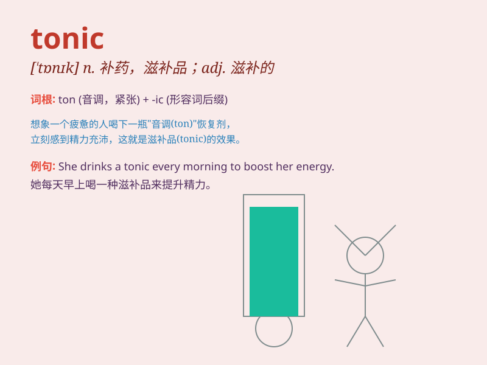

## tonic

**英音:** _[\'tɒnɪk]_ **美音:** _[\'tɑnɪk]_

**译义:** *adj.激励的,滋补的n.滋补剂,滋补品*

### 短语

+ **tonic water:** _奎宁水；汤力水_

+ **tonic note:** _主音_

+ **hair tonic:** _生发油；护发素_

+ **tonic effect:** _滋补作用；强身效果_

+ **tonic chord:** _主和弦_

### 例句

#### 例句1

> **Ginger is believed to have tonic properties.**

**中文翻译:** 生姜被认为具有滋补的特性。

**单词释义:** 滋补的

#### 例句2

> **A cold shower can be a tonic in the morning.**

**中文翻译:** 早晨冲个凉水澡能让人精神振奋。

**单词释义:** 使人精神振奋的

#### 例句3

> **The music served as a tonic to her troubled mind.**

**中文翻译:** 这音乐对她烦乱的心情起了抚慰的作用。

**单词释义:** 起抚慰作用的

### 背诵小故事

> A man was always tired and weak. One day, he drank a special liquid
called \'tonic\' and felt energetic and strong immediately. From then
on, he knew tonic could give him vitality.

**一个男人总是又累又虚弱。有一天，他喝了一种叫做'补药'的特殊液体，立刻感到精力充沛、身体强壮。从那以后，他知道了补药能给他带来活力。**

### 图义

