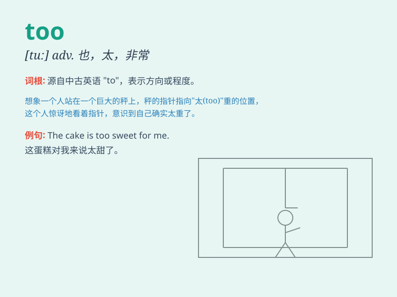

## too

**英音:** _[tuː]_ **美音:** _[tu]_

**译义:** *adv.也,太过份*

### 短语

+ **too much:** _太多；过多_

+ **too many:** _太多；过多_

+ **all too:** _实在太；非常_

+ **none too:** _一点也不_

+ **only too:** _非常；极其_

### 例句

#### 例句1

> **This dress is too small for me.**

**中文翻译:** 这条裙子对我来说太小了。

**单词释义:** 太；过于

#### 例句2

> **He is too young to go to school.**

**中文翻译:** 他太小了，还不能上学。

**单词释义:** 太；过于

#### 例句3

> **There are too many people in the room.**

**中文翻译:** 房间里人太多了。

**单词释义:** 太；过多

### 背诵小故事

> 有一只小兔子，它总觉得自己拥有的胡萝卜 too
少。于是它努力寻找，最后在一个神秘的地方发现了好多胡萝卜，它开心极了，因为现在它的胡萝卜不再少了。

**有一只小兔子，它总觉得自己拥有的胡萝卜太多了。于是它努力寻找，最后在一个神秘的地方发现了好多胡萝卜，它开心极了，因为现在它的胡萝卜不再少了。**

### 图义

