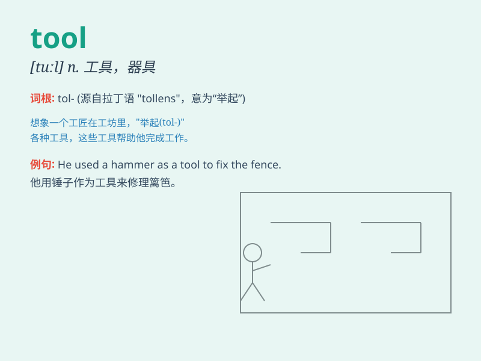

## tool

**英音:** _[tuːl]_ **美音:** _[tul]_

**译义:**
*n.工具,用具,爪牙,走狗,手段vt.用工具加工,使用设备vi.使用工具*

### 短语

+ **power tool:** _电动工具_

+ **tool kit:** _工具箱_

+ **hand tool:** _手工工具_

+ **garden tool:** _园艺工具_

+ **tool shed:** _工具房_

### 例句

#### 例句1

> **This is a useful tool for woodworking.**

**中文翻译:** 这是一个用于木工的有用工具。

**单词释义:** 工具

#### 例句2

> **The computer is a powerful tool in modern society.**

**中文翻译:** 在现代社会，电脑是一种强大的工具。

**单词释义:** 工具

#### 例句3

> **He always keeps his tools in good condition.**

**中文翻译:** 他总是把他的工具保持在良好的状态。

**单词释义:** 工具

### 背诵小故事

> A young inventor was working hard in his workshop. One day, he needed
a special tool to fix a machine. After searching everywhere, he finally
found the exact tool and completed his invention. The tool was his key
to success!

**一位年轻的发明家在他的工作室努力工作。有一天，他需要一个特殊的工具来修理一台机器。四处寻找后，他终于找到了确切的工具并完成了他的发明。这个工具是他成功的关键！**

### 图义

