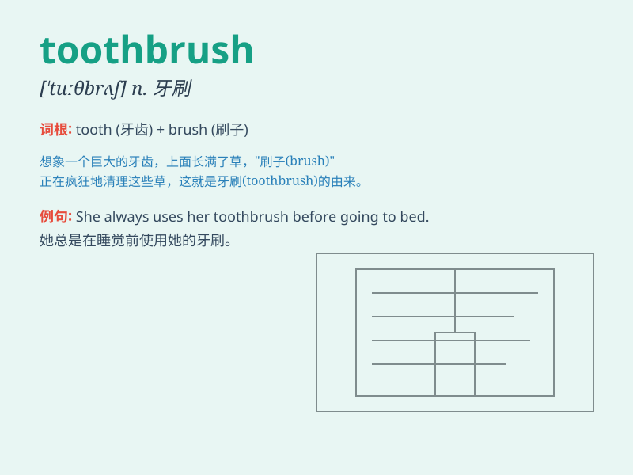

## toothbrush

**英音:** _[\'tuːθbrʌʃ]_ **美音:** _[\'tuθbrʌʃ]_

**译义:** *n.牙刷*

### 短语

+ **electric toothbrush:** _电动牙刷_

+ **disposable toothbrush:** _一次性牙刷_

+ **soft-bristled toothbrush:** _软毛牙刷_

+ **hard-bristled toothbrush:** _硬毛牙刷_

+ **travel toothbrush:** _旅行牙刷_

### 例句

#### 例句1

> **I need to buy a new toothbrush.**

**中文翻译:** 我需要买一把新牙刷。

**单词释义:** 牙刷

#### 例句2

> **She brushes her teeth with an electric toothbrush.**

**中文翻译:** 她用电动牙刷刷牙。

**单词释义:** 牙刷

#### 例句3

> **The toothbrush is too hard for my sensitive teeth.**

**中文翻译:** 这把牙刷对我敏感的牙齿来说太硬了。

**单词释义:** 牙刷

### 背诵小故事

> One day, a little boy forgot to bring his toothbrush when he went on
a trip. He had a hard time cleaning his teeth. From then on, he always
remembered to pack his toothbrush. Toothbrush is the thing we use to
clean our teeth.

**有一天，一个小男孩去旅行时忘了带牙刷。他清洁牙齿很困难。从那以后，他总是记得带上他的牙刷。toothbrush
就是我们用来清洁牙齿的东西。**

### 图义

