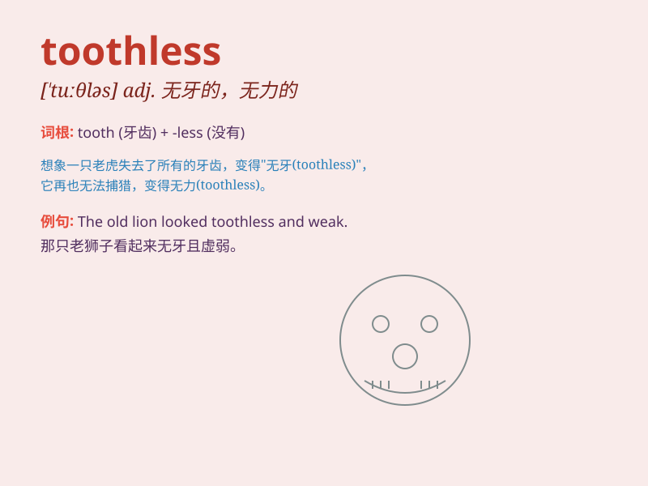

## toothless

**英音:** _[\'tuːθləs]_ **美音:** _[\'tuθləs]_

**译义:** *adj.无齿的*

### 短语

+ **toothless tiger:** _纸老虎_

+ **toothless law:** _无法实施的法律_

+ **toothless smile:** _没有牙齿的微笑_

+ **toothless threat:** _无力的威胁_

+ **toothless old man:** _没牙的老人_

### 例句

#### 例句1

> **The old tiger was toothless and could no longer hunt.**

**中文翻译:** 这只年老的老虎没有牙齿了，再也不能捕猎了。

**单词释义:** 没有牙齿的

#### 例句2

> **The toothless child smiled happily.**

**中文翻译:** 这个没长牙的孩子开心地笑了。

**单词释义:** 没有牙齿的

#### 例句3

> **The dragon in the story was depicted as toothless and
harmless.**

**中文翻译:** 故事中的龙被描绘成没有牙齿且无害的。

**单词释义:** 没有牙齿的

### 背诵小故事

> Once upon a time, there was a dragon named Toothless. It had no teeth
and couldn\'t bite. But it was still very friendly and loved to play.
People called it Toothless because of its toothless mouth.

**从前，有一只叫无牙的龙。它没有牙齿，不能咬东西。但它仍然非常友好，喜欢玩耍。人们因为它没有牙齿的嘴巴而叫它无牙。**

### 图义

