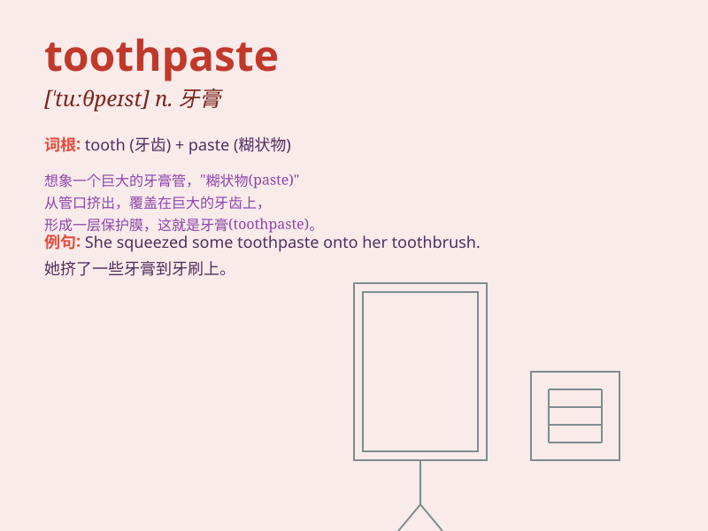

## toothpaste

**英音:** _[\'tuːθpeɪst]_ **美音:** _[\'tuθpest]_

**译义:** *n.牙膏*

### 短语

+ **squeeze toothpaste:** _挤牙膏_

+ **tube of toothpaste:** _一管牙膏_

+ **brand of toothpaste:** _牙膏品牌_

+ **fresh toothpaste:** _清新的牙膏_

+ **use toothpaste:** _使用牙膏_

### 例句

#### 例句1

> **I need to buy some toothpaste at the supermarket.**

**中文翻译:** 我需要在超市买一些牙膏。

**单词释义:** 牙膏

#### 例句2

> **The toothpaste has a minty flavor.**

**中文翻译:** 这款牙膏有薄荷味。

**单词释义:** 牙膏

#### 例句3

> **She squeezed too much toothpaste onto her toothbrush.**

**中文翻译:** 她在牙刷上挤了太多牙膏。

**单词释义:** 牙膏

### 背诵小故事

> One day, the little bear was brushing his teeth. But he found there
was no toothpaste. So he went to the store and bought a new tube of
toothpaste. With it, his teeth became clean and shiny.

**一天，小熊在刷牙。但他发现没有牙膏了。于是他去商店买了一管新的牙膏。用了它，小熊的牙齿变得干净又闪亮。**

### 图义

