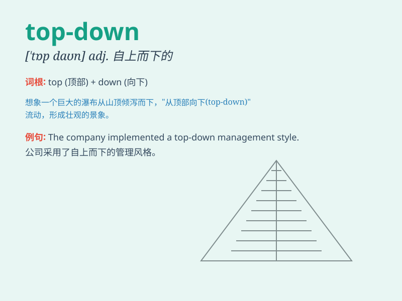

## top-down

**英音:** _[ˌtɒp ˈdaʊn]_ **美音:** _[ˌtɑːp ˈdaʊn]_

**译义:** *adj. 自上而下的；组织管理严密的*

### 短语

+ **top-down management:** _自上而下的管理_

+ **top-down approach:** _自上而下的方法_

+ **top-down design:** _自顶向下设计_

+ **top-down analysis:** _自顶向下分析_

+ **top-down control:** _自上而下的控制_

### 例句

#### 例句1

> **The company\'s management approach is top-down, with decisions
made at the executive level and passed down to lower levels.**

**中文翻译:**
这家公司的管理方式是自上而下的，决策由管理层做出然后传达给下层。

**单词释义:** 自上而下的

#### 例句2

> **The top-down design of the building made it very efficient in
terms of space utilization.**

**中文翻译:** 这座建筑的自上而下的设计在空间利用方面非常高效。

**单词释义:** 自上而下的

#### 例句3

> **We need to change this top-down style of leadership and encourage
more bottom-up input.**

**中文翻译:**
我们需要改变这种自上而下的领导风格，鼓励更多自下而上的意见。

**单词释义:** 自上而下的

### 背诵小故事

> Imagine a king sitting at the top of a castle, giving orders that
flow down to every soldier and servant. This shows how things are
managed in a top-down way, with decisions coming from the top and
flowing downward.

**想象一下，一位国王坐在城堡的顶端，下达命令，这些命令向下传递给每一个士兵和仆人。这就展示了自上而下的管理方式，决策来自高层并向下传递。**

### 图义

