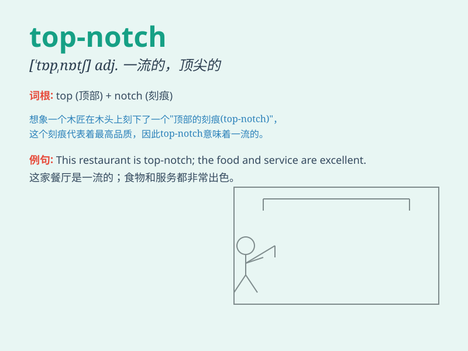

## top-notch

**英音:** _[tɒp nɒtʃ]_ **美音:** _[tɑːp nɑːtʃ]_

**译义:** *adj. 一流的，顶尖的；n. 最高点，顶端*

### 短语

+ **top-notch quality:** _一流的质量_

+ **top-notch service:** _顶级服务_

+ **top-notch performance:** _卓越的表现_

+ **top-notch talent:** _顶尖人才_

+ **top-notch facility:** _一流的设施_

### 例句

#### 例句1

> **The hotel offers top-notch service.**

**中文翻译:** 这家酒店提供一流的服务。

**单词释义:** 一流的；顶级的

#### 例句2

> **She is a top-notch athlete.**

**中文翻译:** 她是一位顶尖运动员。

**单词释义:** 顶尖的；杰出的

#### 例句3

> **This restaurant is known for its top-notch cuisine.**

**中文翻译:** 这家餐厅以其一流的菜肴而闻名。

**单词释义:** 一流的；卓越的

### 背诵小故事

> Once upon a time, a young artist aimed to create the top-notch
painting. He spent days and nights perfecting it. Finally, his
masterpiece was recognized as the best. \'Top-notch\' means being of the
highest quality.

**从前，有一位年轻的艺术家立志创作一幅顶级的画作。他日夜不停地完善它。最终，他的杰作被认为是最棒的。'top-notch'意思是顶级的、一流的。**

### 图义

