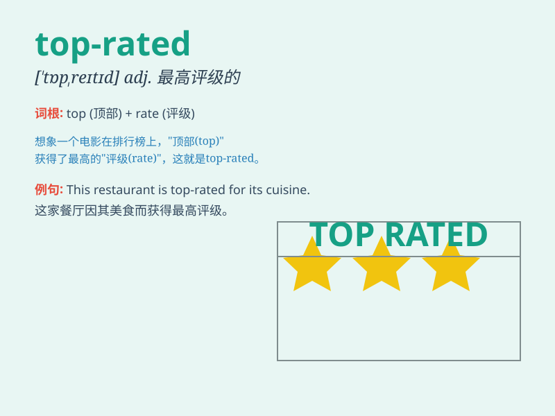

## top-rated

**英音:** _null_ **美音:** _null_

**译义:** *null*

### 短语

+ **top-rated show:** _顶级节目_

+ **top-rated product:** _顶级产品_

+ **top-rated service:** _顶级服务_

+ **top-rated restaurant:** _顶级餐厅_

+ **top-rated movie:** _顶级电影_

### 例句

#### 例句1

> **This is a top-rated movie that everyone should watch.**

**中文翻译:** 这是一部每个人都应该看的顶级电影。

**单词释义:** 顶级的，一流的（用于形容电影）

#### 例句2

> **The top-rated restaurant in town offers excellent cuisine.**

**中文翻译:** 镇上这家一流的餐厅提供美味的菜肴。

**单词释义:** 顶级的，一流的（用于形容餐厅）

#### 例句3

> **She bought a top-rated laptop for her work.**

**中文翻译:** 她为工作买了一台顶级的笔记本电脑。

**单词释义:** 顶级的，一流的（用于形容笔记本电脑）

### 背诵小故事

> Imagine a big competition. All the products are fighting to be the
best. The one that gets the most praise and is at the very top is the
top-rated one. It\'s like the winner of a race, standing out among all
the others.

**想象一场大型竞赛。所有的产品都在力争成为最好的。那个获得最多称赞并且处于最顶端的就是顶级的、一流的。它就像赛跑的冠军，在所有其他产品中脱颖而出。**

### 图义

