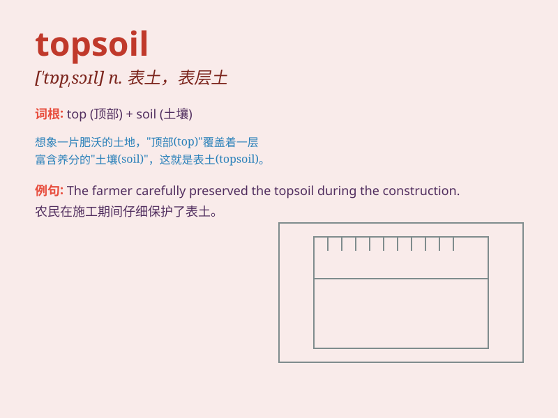

## topsoil

**英音:** _[\'tɒpsɒɪl]_ **美音:** _[\'tɑp\'sɔɪl]_

**译义:** *n.上层土,表层土*

### 短语

+ **rich topsoil:** _肥沃的表土_

+ **eroded topsoil:** _被侵蚀的表土_

+ **loose topsoil:** _疏松的表土_

+ **preserve topsoil:** _保护表土_

+ **fertile topsoil:** _肥沃的表土_

### 例句

#### 例句1

> **The topsoil was eroded by the heavy rain.**

**中文翻译:** 表层土壤被大雨侵蚀了。

**单词释义:** 表层土壤

#### 例句2

> **We need to protect the topsoil to ensure good crop growth.**

**中文翻译:** 我们需要保护表层土壤以确保农作物良好生长。

**单词释义:** 表层土壤

#### 例句3

> **The quality of the topsoil in this area is poor.**

**中文翻译:** 这个地区的表层土壤质量很差。

**单词释义:** 表层土壤

### 背诵小故事

> A farmer was very worried because the topsoil of his field was being
washed away by heavy rain. He worked hard to protect it as topsoil is
the precious upper layer that helps crops grow.

**一位农民非常担心，因为他田地里的表土被大雨冲走了。他努力保护它，因为表土是帮助农作物生长的珍贵上层土壤。**

### 图义

