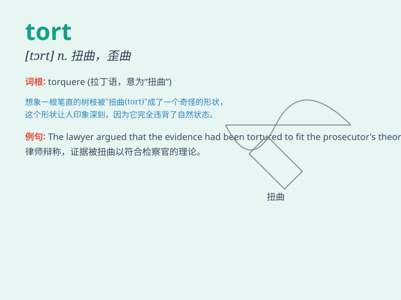

## tort

**英音:** _[tɔːt]_ **美音:** _[tɔrt]_

**译义:** *n.[律]民事侵权行为*

### 短语

+ **tort law:** _侵权法_

+ **intentional tort:** _故意侵权_

+ **negligent tort:** _过失侵权_

+ **tort liability:** _侵权责任_

+ **tort feasor:** _侵权行为人_

### 例句

#### 例句1

> **The law of torts deals with civil wrongs that cause harm to
individuals.**

**中文翻译:** 侵权法处理对个人造成伤害的民事过错。

**单词释义:** 侵权行为

#### 例句2

> **He filed a lawsuit for tort after the accident.**

**中文翻译:** 事故发生后，他提起了侵权诉讼。

**单词释义:** 侵权行为

#### 例句3

> **The company was accused of committing a tort against its
competitors.**

**中文翻译:** 该公司被指控对其竞争对手犯下侵权行为。

**单词释义:** 侵权行为

### 背诵小故事

> A man was wrongly accused of a crime, which was a serious tort. But
he found evidence to prove his innocence. Finally, justice was served
and the real tortfeasor was punished.

**一个男人被错误地指控犯罪，这是严重的侵权行为。但他找到了证据证明自己的清白。最终，正义得到伸张，真正的侵权者受到了惩罚。**

### 图义

