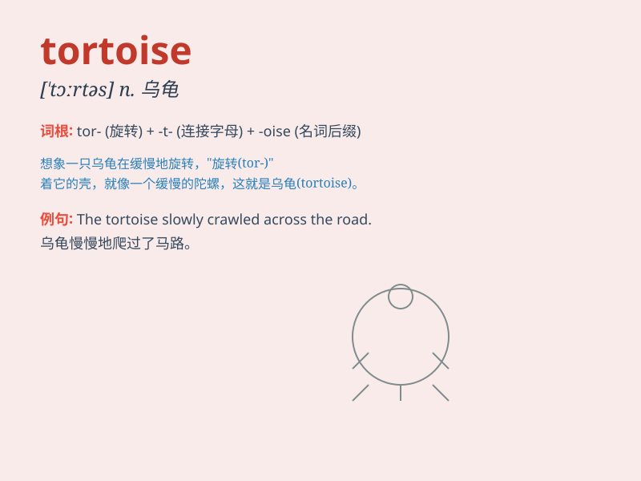

## tortoise

**英音:** _[ˈtɔ:təs]_ **美音:** _[ˈtɔrtəs]_

**译义:** *n.龟,迟缓的人*

### 短语

+ **tortoise shell:** _龟甲；玳瑁壳_

+ **giant tortoise:** _巨型陆龟_

+ **tortoise speed:** _龟速_

+ **land tortoise:** _陆龟_

+ **tortoise habitat:** _乌龟栖息地_

### 例句

#### 例句1

> **The tortoise moved slowly along the path.**

**中文翻译:** 乌龟沿着小路缓慢地移动。

**单词释义:** 乌龟

#### 例句2

> **The hare laughed at the tortoise for being so slow.**

**中文翻译:** 兔子嘲笑乌龟走得太慢。

**单词释义:** 乌龟

#### 例句3

> **I saw a big tortoise in the zoo yesterday.**

**中文翻译:** 昨天我在动物园看到了一只大乌龟。

**单词释义:** 乌龟

### 背诵小故事

> A little boy went to the zoo and saw a strange animal. It moved
slowly and had a hard shell. The zookeeper told him it was a tortoise.
The boy was amazed by its unique look and never forgot the word.

**一个小男孩去动物园，看到了一种奇怪的动物。它移动缓慢，还有一个坚硬的壳。动物园管理员告诉他这是一只乌龟。这个男孩对它独特的样子感到惊奇，从此再也没忘记\'tortoise\'这个单词。**

### 图义

