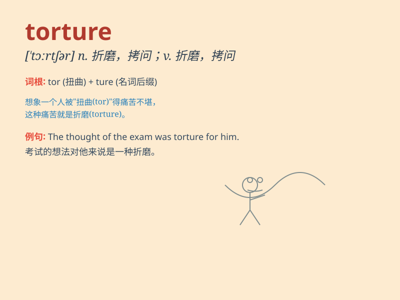

## torture

**英音:** _[\'tɔːtʃə]_ **美音:** _[\'tɔrtʃɚ]_

**译义:** *n.折磨,痛苦,拷问,拷打vt.拷问,曲解,折磨,使弯曲*

### 短语

+ **mental torture:** _精神折磨_

+ **suffer torture:** _遭受折磨_

+ **torture chamber:** _刑讯室_

+ **inflict torture:** _施加折磨_

+ **endure torture:** _忍受折磨_

### 例句

#### 例句1

> **The prisoner was subjected to torture to extract a
confession.**

**中文翻译:** 这名囚犯遭受了酷刑以逼供。

**单词释义:** 酷刑；折磨

#### 例句2

> **The thought of losing her was torture to him.**

**中文翻译:** 想到要失去她，对他来说是一种折磨。

**单词释义:** 折磨；痛苦

#### 例句3

> **She was tortured by her conscience.**

**中文翻译:** 她受到良心的谴责。

**单词释义:** 使痛苦；使苦恼

### 背诵小故事

> A spy was captured and faced torture. The evil guards used all kinds
of cruel methods to make him reveal secrets. But his strong will
resisted the torture. Remember, \'torture\' means causing extreme pain
and suffering.

**一名间谍被抓获并遭受了酷刑。邪恶的守卫用各种残忍的方法想让他吐露秘密。但他坚强的意志抵抗住了酷刑。记住，'torture'意思是折磨；酷刑。**

### 图义

