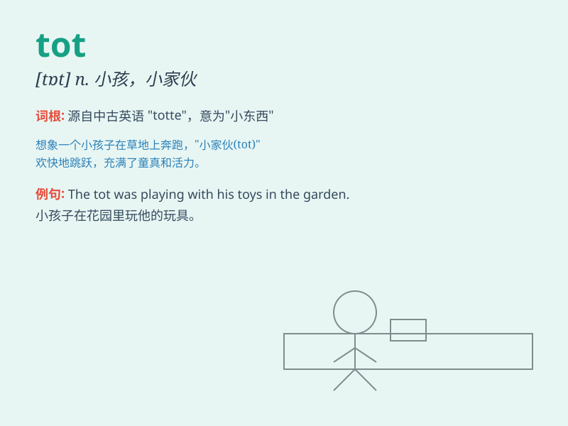

## tot

**英音:** _[tɒt]_ **美音:** _[tɑt]_

**译义:** *n.小孩,微量,合计vi.总计,加算vt.加起来,合计*

### 短语

+ **tot up:** _计算总数；合计_

+ **in tots:** _总共；总计_

+ **a tot of:** _少量（酒）_

+ **tot sth out:** _算出某物的总数_

+ **on the tot:** _（饮酒）以记账方式_

### 例句

#### 例句1

> **The little tot was playing with toys in the corner.**

**中文翻译:** 这个小娃娃正在角落里玩玩具。

**单词释义:** 幼儿；小孩

#### 例句2

> **I\'ll have a tot of whisky before bed.**

**中文翻译:** 我睡前要喝一小杯威士忌。

**单词释义:** 少量的酒

#### 例句3

> **She toted her bag along the street.**

**中文翻译:** 她沿着街道提着她的包。

**单词释义:** 携带；背负

### 背诵小故事

> A little tot was lost in the big forest. He was so scared but still
tried to find his way home. Finally, with the help of a kind bird, the
tot reached home safely. Remember, \'tot\' means a young child.

**一个小孩子在大森林里迷路了。他很害怕，但仍然努力寻找回家的路。最后，在一只善良的鸟的帮助下，这个小孩安全到家了。记住，'tot'意思是小孩。**

### 图义

