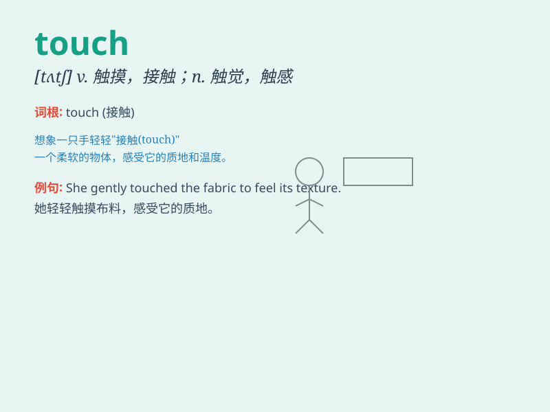

## touch

**英音:** _[tʌtʃ]_ **美音:** _[tʌtʃ]_

**译义:**
*n.触,触觉,接触,联系,轻触,碰,缺点,格调vt.接触,触摸,触及,达到,涉及,点缀,使接触,感动vi.触摸,接近,涉及,提到*

### 短语

+ **get in touch:** _取得联系_

+ **keep in touch:** _保持联系_

+ **lose touch:** _失去联系_

+ **be in touch:** _有联系_

+ **touch base:** _与某人接触（尤指汇报进展情况）_

### 例句

#### 例句1

> **Don\'t touch that hot pan. It\'s very dangerous.**

**中文翻译:** 别碰那个热平底锅。这非常危险。

**单词释义:** 触摸；触碰

#### 例句2

> **The story touched my heart.**

**中文翻译:** 这个故事触动了我的心。

**单词释义:** 触动；感动

#### 例句3

> **Your work has hardly touched the surface of the problem.**

**中文翻译:** 你的工作几乎还没有触及问题的表面。

**单词释义:** 涉及；触及

### 背诵小故事

> One day, a blind boy was lost. A kind girl took his hand and gently
touched it to guide him. The touch of her hand gave the boy warmth and
confidence.

**一天，一个失明的男孩迷路了。一个善良的女孩握住他的手，轻轻地触摸它来引导他。她手的触摸给了男孩温暖和信心。**

### 图义

