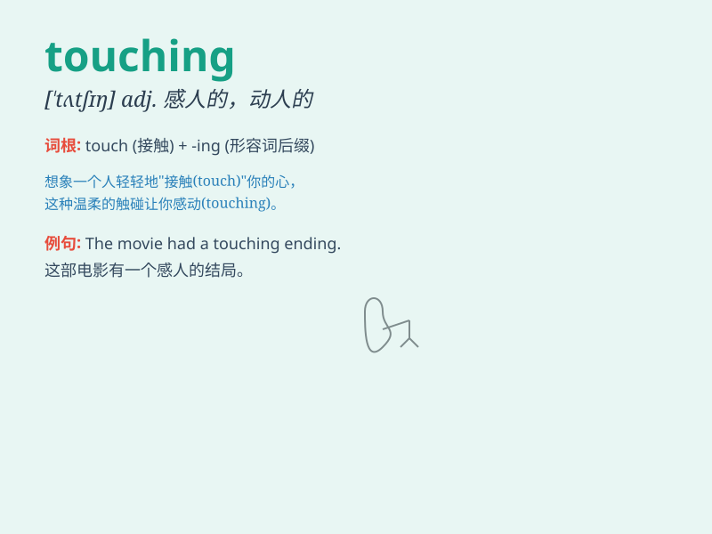

## touching

**英音:** _[\'tʌtʃɪŋ]_ **美音:** _[\'tʌtʃɪŋ]_

**译义:** *adj.动人的,令人同情的 prep.\<书>关于,至于*

### 短语

+ **touching moment:** _感人的时刻_

+ **touching story:** _动人的故事_

+ **touching scene:** _动人的场景_

+ **touching speech:** _感人的演讲_

+ **touching letter:** _感人的信件_

### 例句

#### 例句1

> **The story of the little girl\'s struggle was very touching.**

**中文翻译:** 这个小女孩奋斗的故事非常感人。

**单词释义:** 感人的

#### 例句2

> **His touching speech moved everyone in the audience.**

**中文翻译:** 他感人的演讲打动了观众中的每一个人。

**单词释义:** 感人的

#### 例句3

> **The touching scene of the reunion made them cry.**

**中文翻译:** 团聚的动人场景让他们哭了。

**单词释义:** 动人的

### 背诵小故事

> A little girl was lost in the forest. When a kind-hearted ranger
found her and held her hand, the touching scene made everyone\'s eyes
moist. The moment of connection and care was truly touching.

**一个小女孩在森林里迷路了。当一位善良的护林员找到她并握住她的手时，这令人感动的场景让每个人的眼眶都湿润了。这连接和关怀的一刻真是令人感动。**

### 图义

