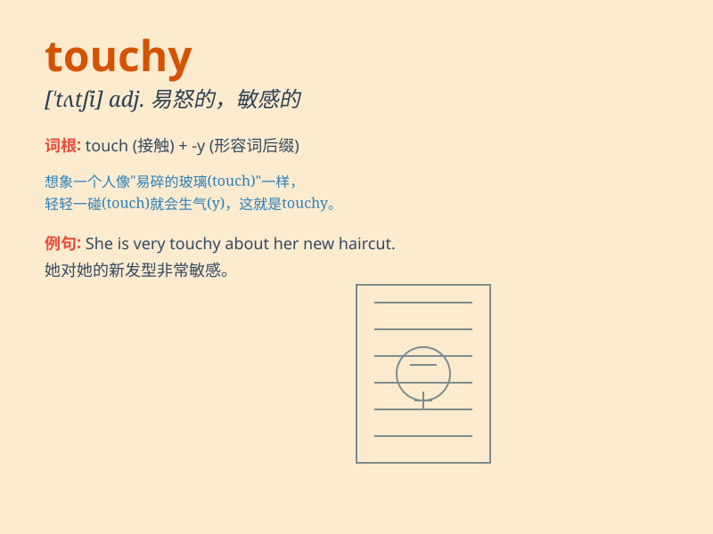

## touchy

**英音:** _[\'tʌtʃɪ]_ **美音:** _[\'tʌtʃi]_

**译义:** *adj.暴躁的,难以处理的,易起火的*

### 短语

+ **touchy subject:** _敏感的话题_

+ **be touchy about:** _对\...\...敏感_

+ **touchy-feely:** _感情外露的；过于情感化的_

+ **a touchy situation:** _棘手的情况_

+ **touchy temper:** _急躁的脾气_

### 例句

#### 例句1

> **He\'s very touchy about his weight.**

**中文翻译:** 他对自己的体重非常敏感。

**单词释义:** 敏感的

#### 例句2

> **The situation is a bit touchy, so we need to handle it
carefully.**

**中文翻译:** 这个情况有点棘手，所以我们需要小心处理。

**单词释义:** 棘手的

#### 例句3

> **She has a touchy temper and gets angry easily.**

**中文翻译:** 她脾气暴躁，很容易生气。

**单词释义:** 暴躁的

### 背诵小故事

> One day, Tom was in a touchy mood. His friend accidentally broke his
favorite pen and he got really angry. But later, he realized he was
overreacting. \'Touchy\' means being easily upset or sensitive.

**有一天，汤姆心情很敏感。他的朋友不小心弄坏了他最喜欢的笔，他就特别生气。但后来，他意识到自己反应过度了。'touchy'意思是容易生气或敏感的。**

### 图义

