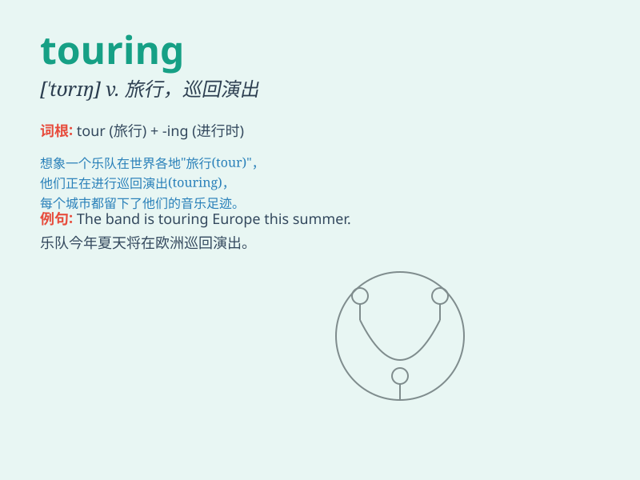

## touring

**英音:** _[ˈtʊərɪŋ]_ **美音:** _[ˈtʊrɪŋ]_

**译义:** *adj.巡回演出的; n.巡回演出; v.巡回演出，旅游(
tour的现在分词 )*

### 短语

+ **touring car:** _旅行车_

+ **touring bike:** _旅行自行车_

+ **touring exhibition:** _巡回展览_

+ **touring musician:** _巡回演出的音乐家_

+ **touring party:** _旅行团_

### 例句

#### 例句1

> **The band is on a touring schedule that covers several cities.**

**中文翻译:** 这个乐队有一个涵盖了几个城市的巡回演出日程。

**单词释义:** 巡回的

#### 例句2

> **We went on a touring holiday in Europe last summer.**

**中文翻译:** 去年夏天我们在欧洲进行了一次巡回度假。

**单词释义:** 巡回的；旅行的

#### 例句3

> **The touring exhibition attracted a large number of visitors.**

**中文翻译:** 这次巡回展览吸引了大量参观者。

**单词释义:** 巡回的

### 背诵小故事

> A group of friends were excited about touring a mysterious castle.
They walked around, exploring every corner. The experience of touring
made them feel like adventurers.

**一群朋友对游览一座神秘的城堡感到兴奋。他们四处走动，探索每一个角落。游览的经历让他们觉得自己像冒险家。**

### 图义

