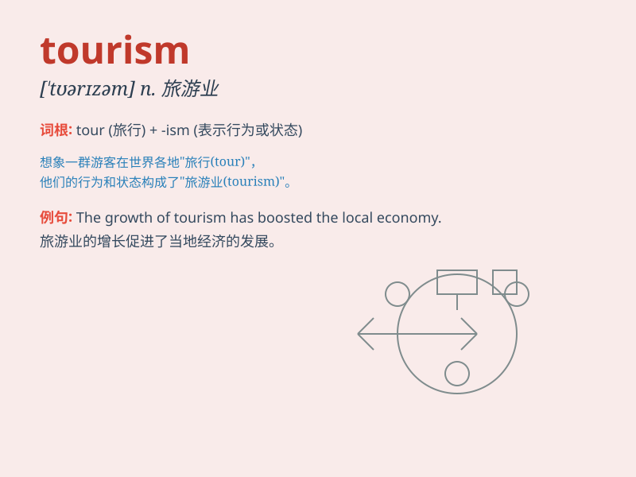

## tourism

**英音:** _[\'tʊərɪz(ə)m]_ **美音:** _[\'tʊrɪzəm]_

**译义:** *n.观光事业,游览*

### 短语

+ **tourism industry:** _旅游业_

+ **tourism destination:** _旅游目的地_

+ **tourism development:** _旅游发展_

+ **tourism attraction:** _旅游景点_

+ **tourism revenue:** _旅游收入_

### 例句

#### 例句1

> **Tourism is a major source of income for many countries.**

**中文翻译:** 旅游业是许多国家的主要收入来源。

**单词释义:** 旅游业

#### 例句2

> **The local government is promoting tourism to attract more
visitors.**

**中文翻译:** 当地政府正在推动旅游业以吸引更多游客。

**单词释义:** 旅游业

#### 例句3

> **The negative impact of tourism on the environment cannot be
ignored.**

**中文翻译:** 旅游业对环境的负面影响不容忽视。

**单词释义:** 旅游业

### 背诵小故事

> One day, Tom went on a long trip. He visited many beautiful places,
saw different cultures and met friendly people. This wonderful
experience made him fall in love with tourism.

**有一天，汤姆去了一次长途旅行。他参观了许多美丽的地方，看到了不同的文化，还遇到了友好的人。这次美妙的经历让他爱上了旅游业。**

### 图义

