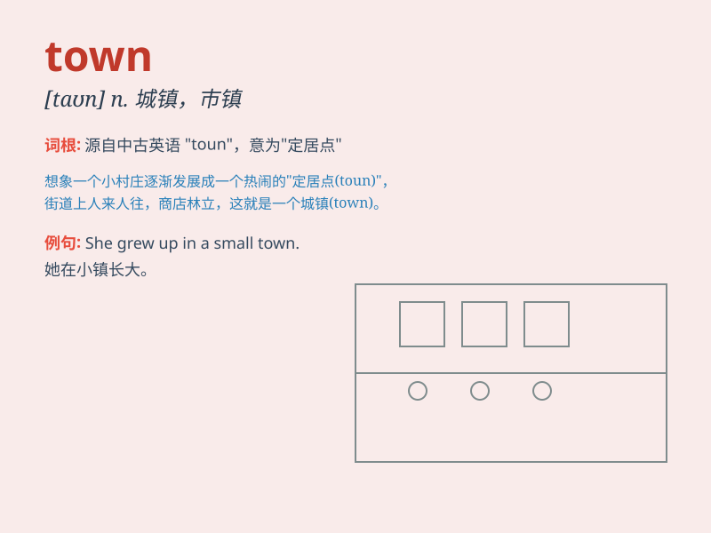

## town

**英音:** _[taʊn]_ **美音:** _[taʊn]_

**译义:** *n.市镇,城镇*

### 短语

+ **town centre:** _城镇中心_

+ **small town:** _小镇_

+ **old town:** _老城区_

+ **town hall:** _市政厅_

+ **out of town:** _不在城里；出城_

### 例句

#### 例句1

> **I grew up in a small town.**

**中文翻译:** 我在一个小镇长大。

**单词释义:** 镇；城镇

#### 例句2

> **The town was crowded with tourists during the holiday.**

**中文翻译:** 假期期间，这个城镇挤满了游客。

**单词释义:** 城镇

#### 例句3

> **She went to town to do some shopping.**

**中文翻译:** 她进城去买东西。

**单词释义:** 城镇；市中心

### 背诵小故事

> Once upon a time, a little boy got lost in a big town. He was scared
but then found a friendly policeman who helped him find his way home.
The town had many stores and people.

**从前，一个小男孩在一个大城镇里迷路了。他很害怕，但随后遇到了一位友好的警察，警察帮助他找到了回家的路。这个城镇有很多商店和人。**

### 图义

