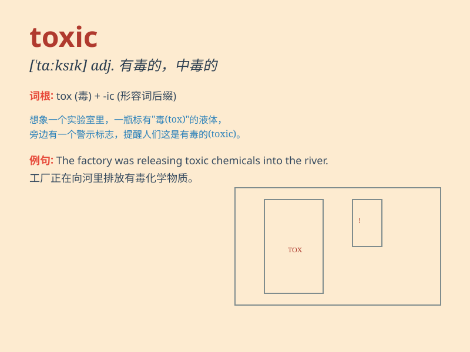

## toxic

**英音:** _[\'tɒksɪk]_ **美音:** _[\'tɑksɪk]_

**译义:** *adj.有毒的,中毒的*

### 短语

+ **toxic waste:** _有毒废物_

+ **toxic gas:** _有毒气体_

+ **toxic substance:** _有毒物质_

+ **toxic environment:** _有毒环境_

+ **toxic effect:** _毒性作用；毒效_

### 例句

#### 例句1

> **The factory was fined for discharging toxic waste into the
river.**

**中文翻译:** 这家工厂因向河流排放有毒废物而被罚款。

**单词释义:** 有毒的

#### 例句2

> **She had a toxic relationship with her ex-boyfriend.**

**中文翻译:** 她和她的前男友有一段有害的关系。

**单词释义:** 有害的

#### 例句3

> **The air in the city is becoming increasingly toxic.**

**中文翻译:** 这个城市的空气正变得越来越有毒害。

**单词释义:** 有毒害的

### 背诵小故事

> A scientist was conducting experiments in the lab. One day, he
accidentally spilled a toxic liquid. It was so dangerous that it could
harm anyone who touched it. From then on, he was very careful when
dealing with such substances.

**一位科学家在实验室做实验。有一天，他不小心洒出了有毒的液体。这液体非常危险，任何人接触到都会受到伤害。从那以后，他在处理这类物质时都非常小心。**

### 图义

