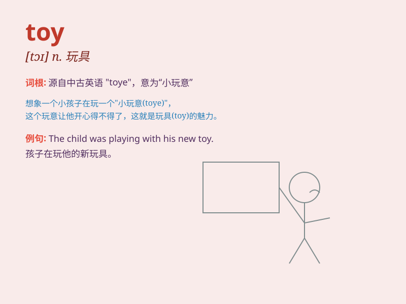

## toy

**英音:** _[tɔɪ]_ **美音:** _[tɔɪ]_

**译义:** *n.玩具,玩物,玩意儿;v.玩弄,戏弄,调情*

### 短语

+ **toy car:** _玩具汽车_

+ **toy store:** _玩具店_

+ **toy soldier:** _玩具士兵_

+ **toy bear:** _玩具熊_

+ **toy plane:** _玩具飞机_

### 例句

#### 例句1

> **The child was playing with a toy car.**

**中文翻译:** 这个孩子正在玩一辆玩具汽车。

**单词释义:** 玩具

#### 例句2

> **She toyed with the idea of going on a trip.**

**中文翻译:** 她漫不经心地考虑着去旅行的想法。

**单词释义:** 漫不经心地考虑

#### 例句3

> **Don\'t toy with my feelings.**

**中文翻译:** 别玩弄我的感情。

**单词释义:** 玩弄

### 背诵小故事

> One day, a little boy was very happy because he got a new toy car. It
was shiny and had cool wheels. He played with it all day and took it
everywhere. The toy made him so joyful.

**有一天，一个小男孩非常高兴，因为他得到了一辆新的玩具车。它闪闪发光，还有很酷的轮子。他一整天都在玩它，走到哪里都带着。这个玩具让他非常快乐。**

### 图义

