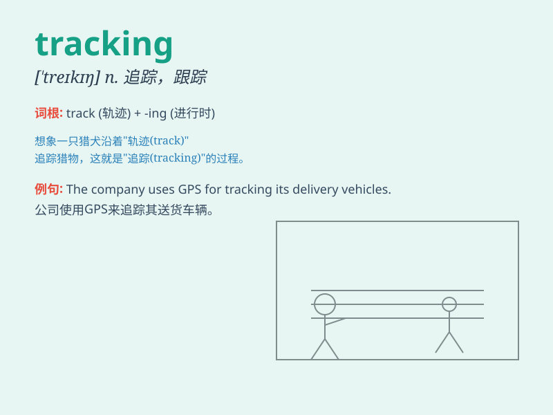

## tracking

**英音:** _[ˈtrækɪŋ]_ **美音:** _[ˈtrækɪŋ]_

**译义:** * 跟踪*

### 短语

+ **tracking system:** _跟踪系统_

+ **tracking device:** _跟踪装置_

+ **tracking number:** _追踪号码_

+ **tracking information:** _跟踪信息_

+ **tracking technology:** _跟踪技术_

### 例句

#### 例句1

> **The tracking system helps us monitor the package\'s location.**

**中文翻译:** 这个追踪系统帮助我们监控包裹的位置。

**单词释义:** 追踪

#### 例句2

> **She is responsible for tracking the sales data.**

**中文翻译:** 她负责跟踪销售数据。

**单词释义:** 跟踪；监测

#### 例句3

> **The police are using advanced tracking technology to catch the
criminals.**

**中文翻译:** 警方正在使用先进的追踪技术来抓捕罪犯。

**单词释义:** 追踪

### 背诵小故事

> A detective was tracking a mysterious thief. He followed the
footprints and clues, never giving up. Finally, with his excellent
tracking skills, he caught the thief. Remember, \'tracking\' means
following and monitoring.

**一位侦探正在追踪一个神秘的小偷。他跟着脚印和线索，从不放弃。最终，凭借他出色的追踪技巧，他抓住了小偷。记住，\'tracking\'意思是跟踪、追踪。**

### 图义

