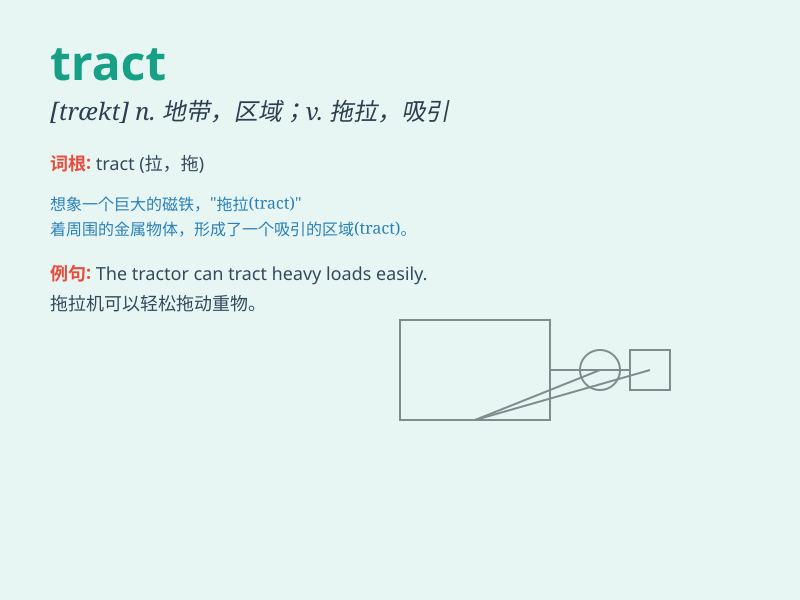

## tract

**英音:** _[trækt]_ **美音:** _[trækt]_

**译义:** *n.广阔的地面,土地,地方,地域,(解剖)管道,小册子*

### 短语

+ **tract of land:** _一片土地_

+ **digestive tract:** _消化道_

+ **respiratory tract:** _呼吸道_

+ **tract housing:** _成片住宅区_

+ **nerve tract:** _神经束_

### 例句

#### 例句1

> **The new road will pass through a large tract of forest.**

**中文翻译:** 新的道路将穿过一大片森林。

**单词释义:** 大片土地；地带

#### 例句2

> **The tract on healthy eating was very informative.**

**中文翻译:** 关于健康饮食的小册子非常有信息量。

**单词释义:** （论述、宣传等的）短文；小册子

#### 例句3

> **He has a tractable personality and is easy to get along with.**

**中文翻译:** 他性格温顺，容易相处。

**单词释义:** 温顺的；易管教的；易处理的

### 背诵小故事

> Imagine a tractor pulling a long tract of land. The tractor works
hard, covering a large tract. So, \'tract\' means a large area of land.

**想象一辆拖拉机在拉一大片土地。拖拉机努力工作，覆盖了一大片。所以，\'tract\'意思是一大片土地。**

### 图义

