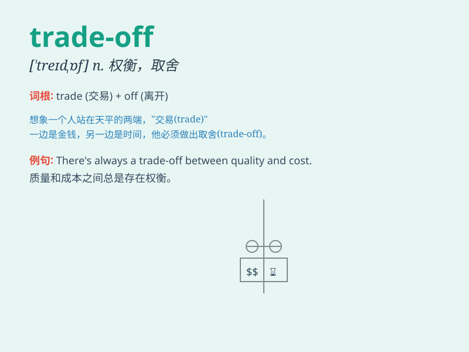

## trade-off

**英音:** _[ˈtreɪd ɒf]_ **美音:** _[ˈtreɪd ɔːf]_

**译义:** *n.（在相互对立的两者之间的）权衡，协调；取舍*

### 短语

+ **make a trade-off:** _做出权衡；进行折衷_

+ **find a trade-off:** _找到折衷办法_

+ **reach a trade-off:** _达成折衷；达成妥协_

+ **consider the trade-off:** _考虑权衡；考虑折衷_

+ **evaluate the trade-off:** _评估权衡；评估折衷_

### 例句

#### 例句1

> **In business, there\'s often a trade-off between quality and
cost.**

**中文翻译:** 在商业中，质量和成本之间常常存在一种权衡。

**单词释义:** 权衡；协调；折衷

#### 例句2

> **The trade-off for having more free time is less income.**

**中文翻译:** 拥有更多自由时间的代价是收入减少。

**单词释义:** （在两者之间的）权衡，协调，折衷

#### 例句3

> **There\'s a trade-off when you choose to work from home; you might
feel isolated.**

**中文翻译:** 当你选择在家工作时，会有一种折衷；你可能会感到孤立。

**单词释义:** （在利弊之间的）权衡，协调，折衷

### 背诵小故事

> A merchant had to make a trade-off. He could either sell a lot of
cheap goods or a few expensive ones. After thinking, he chose a balance
to get the best profit. Trade-off means a compromise or balance.

**一位商人必须做出权衡。他要么出售大量便宜的商品，要么出售少量昂贵的商品。思考之后，他选择了一个平衡以获得最佳利润。Trade-off
意思是妥协或平衡。**

### 图义

