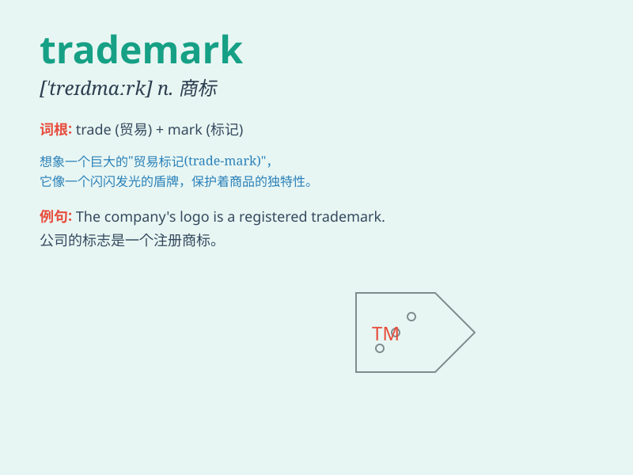

## trademark

**英音:** _[\'treɪdmɑːk]_ **美音:** _[\'tred\'mɑrk]_

**译义:** *n.商标*

### 短语

+ **registered trademark:** _注册商标_

+ **trademark law:** _商标法_

+ **trademark infringement:** _商标侵权_

+ **famous trademark:** _著名商标_

+ **trademark registration:** _商标注册_

### 例句

#### 例句1

> **The Coca-Cola logo is a well-known trademark.**

**中文翻译:** 可口可乐的标志是一个著名的商标。

**单词释义:** 商标

#### 例句2

> **Her unique style of singing has become her trademark.**

**中文翻译:** 她独特的演唱风格已经成为了她的标志。

**单词释义:** 标志；特征

#### 例句3

> **The company\'s trademark is protected by law.**

**中文翻译:** 这家公司的商标受法律保护。

**单词释义:** 商标

### 背诵小故事

> A young entrepreneur had a brilliant idea for a new product. To
protect it, she registered a unique symbol as her trademark. This mark
became instantly recognizable and helped her business soar. Now,
whenever people saw that trademark, they knew it was her quality
product.

**一位年轻的企业家有了一个新产品的绝妙想法。为了保护它，她注册了一个独特的符号作为她的商标。这个商标很快就被人熟知，并帮助她的生意腾飞。现在，每当人们看到那个商标，就知道是她的优质产品。**

### 图义

