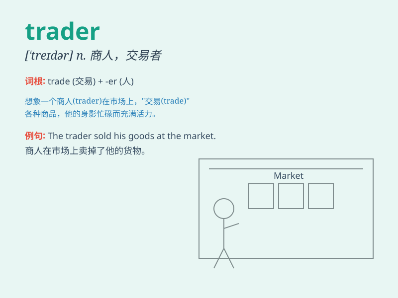

## trader

**英音:** _[\'treɪdə]_ **美音:** _[\'tredɚ]_

**译义:** *n.商人,商船*

### 短语

+ **stock trader:** _股票交易员_

+ **foreign trader:** _外贸商人_

+ **experienced trader:** _经验丰富的交易员_

+ **retail trader:** _零售商人_

+ **commodity trader:** _商品交易商_

### 例句

#### 例句1

> **The trader sold a large quantity of stocks.**

**中文翻译:** 这位交易员出售了大量的股票。

**单词释义:** 交易员

#### 例句2

> **She is an experienced trader in the foreign exchange market.**

**中文翻译:** 她是外汇市场上一位经验丰富的交易商。

**单词释义:** 交易商

#### 例句3

> **The trader made a huge profit from the recent trade deal.**

**中文翻译:** 这位贸易商从最近的贸易交易中获得了巨额利润。

**单词释义:** 贸易商

### 背诵小故事

> A trader named Tom was always on the move. He traveled far and wide
to buy and sell goods. One day, he made a huge profit by trading rare
jewels. His success made him a famous trader.

**一个叫汤姆的商人总是四处奔波。他长途跋涉去买卖货物。有一天，他通过交易稀有珠宝获得了巨额利润。他的成功使他成为了一位著名的商人。**

### 图义

