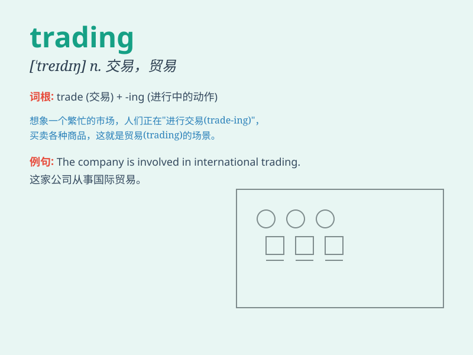

## trading

**英音:** _[\'treɪdɪŋ]_ **美音:** _[\'tredɪŋ]_

**译义:** *n.贸易*

### 短语

+ **trading company:** _贸易公司_

+ **trading partner:** _贸易伙伴_

+ **trading volume:** _交易量_

+ **trading day:** _交易日_

+ **trading platform:** _交易平台_

### 例句

#### 例句1

> **The trading volume on the stock market was high today.**

**中文翻译:** 今天股票市场的交易量很高。

**单词释义:** 交易

#### 例句2

> **International trading helps countries grow their economies.**

**中文翻译:** 国际贸易有助于各国发展经济。

**单词释义:** 贸易

#### 例句3

> **He makes a living by trading in antiques.**

**中文翻译:** 他靠买卖古董为生。

**单词释义:** 买卖

### 背诵小故事

> A merchant was engaged in trading. He traveled far and wide, buying
and selling goods. His trading adventures led him to meet many people
and gain rich experiences. Through trading, he made his fortune and
lived a happy life.

**一位商人从事贸易。他四处奔波，买卖货物。他的贸易冒险使他结识了许多人并获得了丰富的经验。通过贸易，他发了财，过上了幸福的生活。**

### 图义

