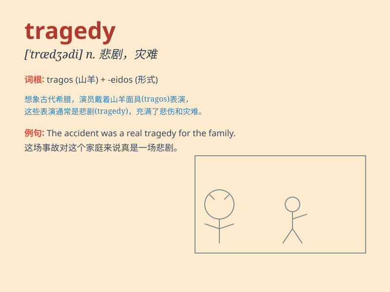

## tragedy

**英音:** _[\'trædʒɪdɪ]_ **美音:** _[\'trædʒədi]_

**译义:** *n.悲剧,惨案,悲惨,灾难*

### 短语

+ **classical tragedy:** _古典悲剧_

+ **family tragedy:** _家庭悲剧_

+ **tragedy of fate:** _命运的悲剧_

+ **tragedy queen:** _悲剧女王_

+ **avoid tragedy:** _避免悲剧_

### 例句

#### 例句1

> **The tragedy of Romeo and Juliet is well-known around the
world.**

**中文翻译:** 罗密欧与朱丽叶的悲剧在全世界都广为人知。

**单词释义:** 悲剧；悲惨之事

#### 例句2

> **The earthquake was a great tragedy that claimed many lives.**

**中文翻译:** 这场地震是一场夺走许多生命的巨大悲剧。

**单词释义:** 灾难；不幸

#### 例句3

> **His life was marked by one tragedy after another.**

**中文翻译:** 他的一生充满了一个又一个的悲剧。

**单词释义:** 不幸；灾祸

### 背诵小故事

> A king was very happy until one day, a big disaster struck his
kingdom. Many people died and it was a total mess. This sad event was a
tragedy. The king learned a hard lesson.

**一位国王原本非常快乐，直到有一天，一场巨大的灾难袭击了他的王国。许多人死去，一片混乱。这个悲伤的事件就是一场悲剧。国王得到了惨痛的教训。**

### 图义

