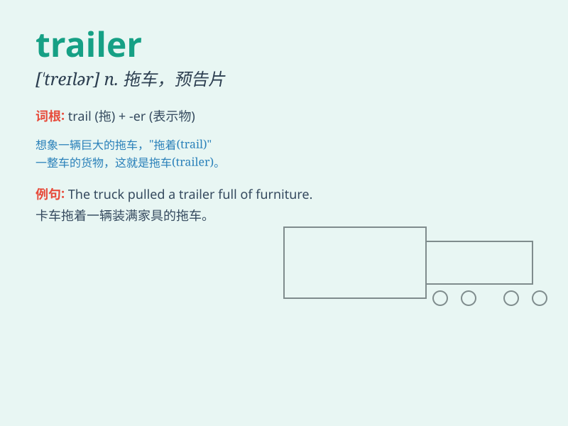

## trailer

**英音:** _[\'treɪlə]_ **美音:** _[\'trelɚ]_

**译义:** *n.追踪者,拖车vi.乘拖车式活动房屋旅行vt.用拖车载运*

### 短语

+ **trailer park:** _活动住房集中地；拖车式活动房屋停车场_

+ **trailer hitch:** _拖车挂钩_

+ **movie trailer:** _电影预告片_

+ **trailer home:** _活动房屋；拖车型住房_

+ **trailer load:** _一拖车的货物_

### 例句

#### 例句1

> **The trailer of the new movie looks very exciting.**

**中文翻译:** 新电影的预告片看起来非常令人兴奋。

**单词释义:** 预告片

#### 例句2

> **He lives in a trailer park.**

**中文翻译:** 他住在一个拖车式活动房屋停车场。

**单词释义:** 拖车式活动房屋

#### 例句3

> **The truck was pulling a trailer full of goods.**

**中文翻译:** 卡车拖着一辆装满货物的挂车。

**单词释义:** 挂车；拖车

### 背诵小故事

> A man was driving a big truck. At the back of the truck, there was a
trailer carrying many goods. But suddenly, the trailer got detached and
caused a big problem on the road.

**一个男人正在驾驶一辆大卡车。在卡车的后面，有一个挂车，载着很多货物。但突然，挂车脱落了，在路上造成了大麻烦。**

### 图义

