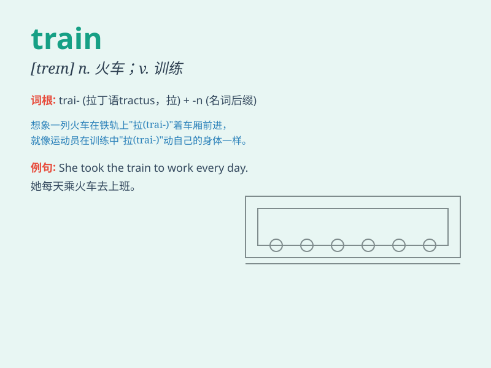

## train

**英音:** _[treɪn]_ **美音:** _[tren]_

**译义:**
*n.火车,列车,行列,后果,顺序,长队,长袍(裙)拖地的部分,导火线vt.训练,培养,瞄准,(园艺)整枝vi.锻炼*

### 短语

+ **train station:** _火车站_

+ **train ticket:** _火车票_

+ **by train:** _乘火车_

+ **train journey:** _火车旅行_

+ **train driver:** _火车司机_

### 例句

#### 例句1

> **The train is arriving at the station.**

**中文翻译:** 火车正在抵达车站。

**单词释义:** 火车

#### 例句2

> **She trained hard for the competition.**

**中文翻译:** 她为比赛刻苦训练。

**单词释义:** 训练

#### 例句3

> **The new employees will be trained next week.**

**中文翻译:** 新员工将于下周接受培训。

**单词释义:** 培训

### 背诵小故事

> One day, I was late for work. I ran to the station and saw a long
train. I jumped on it just in time. The train took me to my destination
quickly. From then on, I always remember the word \'train\' as my
savior.

**有一天，我上班要迟到了。我跑到车站，看到了一列长长的火车。我刚好及时跳上了它。火车很快把我带到了目的地。从那以后，我总是把'train'这个词当作我的救星来记住。**

### 图义

