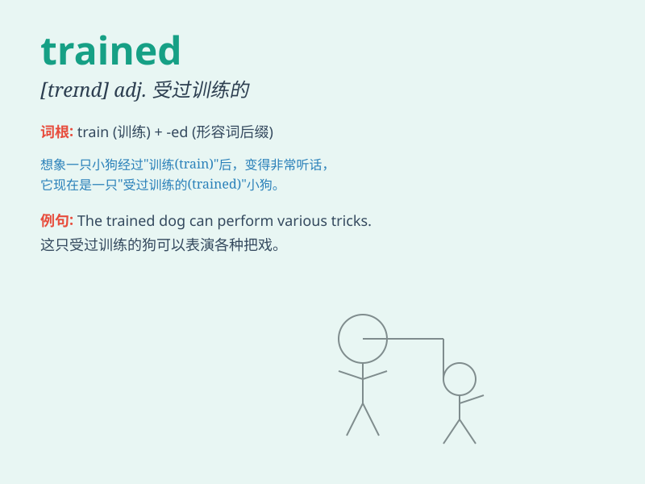

## trained

**英音:** _[treɪnd]_ **美音:** _[treɪnd]_

**译义:**
*adj.训练有素的,有经验的;v.训练,培养(动词train的过去式和过去分词)*

### 短语

+ **trained nurse:** _受过训练的护士_

+ **trained athlete:** _训练有素的运动员_

+ **trained dog:** _训练过的狗_

+ **trained staff:** _训练有素的员工_

+ **trained eye:** _敏锐的目光；内行的眼光_

### 例句

#### 例句1

> **She is a trained nurse.**

**中文翻译:** 她是一名受过训练的护士。

**单词释义:** 受过训练的

#### 例句2

> **The dog has been trained to do tricks.**

**中文翻译:** 这只狗已经被训练会做各种把戏。

**单词释义:** 训练过的

#### 例句3

> **We need trained workers for this project.**

**中文翻译:** 我们这个项目需要受过培训的工人。

**单词释义:** 受过培训的

### 背诵小故事

> A young man dreamed of becoming a great athlete. So, he trained hard
every day. He ran, jumped, and lifted weights. Finally, his trained body
led him to victory.

**一个年轻人梦想成为伟大的运动员。所以，他每天刻苦训练。他跑步、跳跃和举重。最终，他经过训练的身体带给他胜利。**

### 图义

