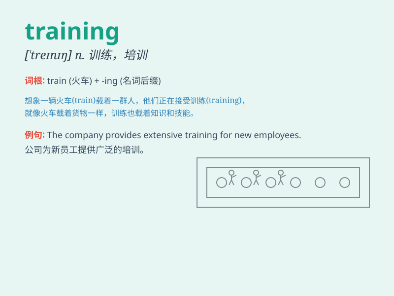

## training

**英音:** _[\'treɪnɪŋ]_ **美音:** _[\'trenɪŋ]_

**译义:** *n.训练,练习adj.训练的*

### 短语

+ **training course:** _培训课程_

+ **job training:** _职业培训_

+ **training program:** _培训计划_

+ **physical training:** _体育训练_

+ **vocational training:** _职业训练_

### 例句

#### 例句1

> **I\'m undergoing intense training to improve my running speed.**

**中文翻译:** 我正在接受高强度的训练以提高我的跑步速度。

**单词释义:** 训练；培训

#### 例句2

> **The training program for new employees starts next week.**

**中文翻译:** 新员工的培训计划下周开始。

**单词释义:** 训练；培训

#### 例句3

> **She has received years of training in classical music.**

**中文翻译:** 她接受了多年的古典音乐训练。

**单词释义:** 训练；培训

### 背诵小故事

> A young athlete was determined to succeed. Every day, he engaged in
intense training, running, lifting weights, and practicing skills.
Through this continuous training, he finally achieved his goal and stood
on the winner\'s podium.

**一位年轻的运动员决心要成功。每天，他都进行高强度的训练，跑步、举重、练习技巧。通过这种持续的训练，他最终实现了目标，站在了领奖台上。**

### 图义

