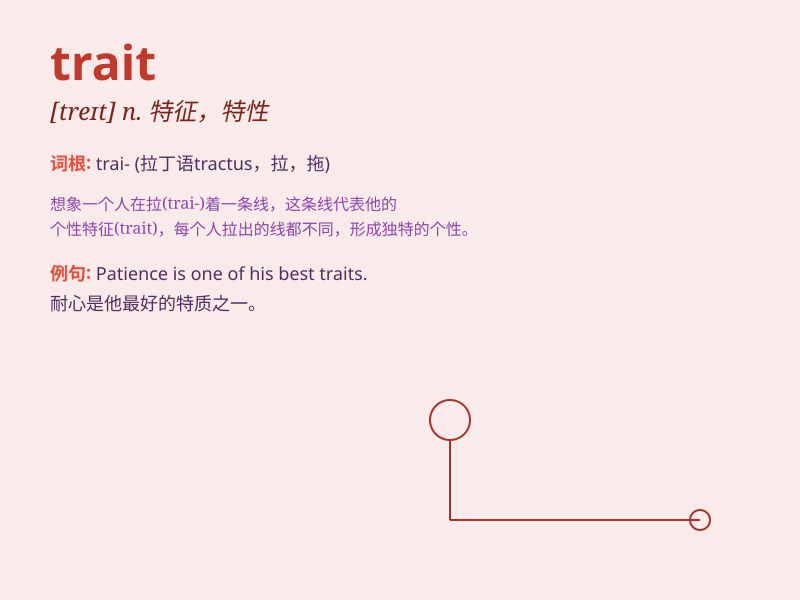

## trait

**英音:** _[treɪt; treɪ]_ **美音:** _[tret]_

**译义:** *n.显著的特点,特性*

### 短语

+ **personality trait:** _性格特点_

+ **character trait:** _性格特征_

+ **dominant trait:** _显性性状_

+ **recessive trait:** _隐性性状_

+ **inherited trait:** _遗传性状_

### 例句

#### 例句1

> **One of his most noticeable traits is his kindness.**

**中文翻译:** 他最显著的特点之一就是他的善良。

**单词释义:** 特点；特性

#### 例句2

> **Genes determine certain traits in an organism.**

**中文翻译:** 基因决定了生物体的某些特征。

**单词释义:** 特征；特质

#### 例句3

> **Her leadership trait helped her succeed in the project.**

**中文翻译:** 她的领导特质帮助她在这个项目中取得成功。

**单词释义:** 特质；品质

### 背诵小故事

> Once upon a time, a detective was solving a case. The key trait of
the criminal was a unique scar. This trait helped the detective catch
the criminal. Remember, trait means a distinctive quality or
characteristic.

**从前，有一位侦探在破案。罪犯的关键特征是一道独特的伤疤。这个特征帮助侦探抓住了罪犯。记住，trait
意思是显著的特点或特性。**

### 图义

