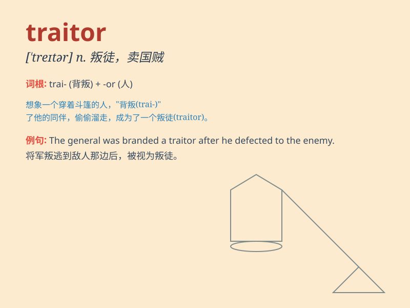

## traitor

**英音:** _[\'treɪtə]_ **美音:** _[\'tretɚ]_

**译义:** *n.叛逆者,叛国者*

### 短语

+ **arch traitor:** _头号叛徒_

+ **political traitor:** _政治叛徒_

+ **betray like a traitor:** _像叛徒一样背叛_

+ **traitor to one\'s country:** _叛国者_

+ **traitor within the ranks:** _内部的叛徒_

### 例句

#### 例句1

> **He was exposed as a traitor to his country.**

**中文翻译:** 他被揭露是背叛自己国家的叛徒。

**单词释义:** 背叛者；卖国贼

#### 例句2

> **The traitor was sentenced to life imprisonment.**

**中文翻译:** 那个叛徒被判处无期徒刑。

**单词释义:** 叛徒

#### 例句3

> **She regarded him as a traitor to their friendship.**

**中文翻译:** 她认为他是他们友谊的叛徒。

**单词释义:** 背叛者

### 背诵小故事

> In a kingdom under attack, a trusted knight named Tom secretly helped
the enemy. When his betrayal was discovered, everyone shouted
\'Traitor!\' Tom\'s actions brought great disaster.

**在一个遭受攻击的王国里，一位名叫汤姆的深受信任的骑士暗中帮助了敌人。当他的背叛被发现时，每个人都大喊'叛徒！'汤姆的行为带来了巨大的灾难。**

### 图义

