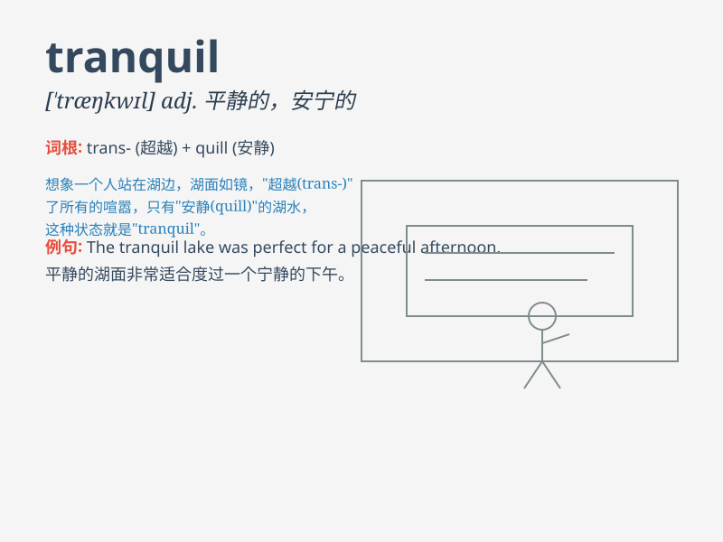

## tranquil

**英音:** _[\'træŋkwɪl]_ **美音:** _[ˈtræŋkwəl]_

**译义:** *adj.安静的*

### 短语

+ **tranquil mind:** _平静的心态_

+ **tranquil scene:** _宁静的场景_

+ **tranquil life:** _平静的生活_

+ **tranquil village:** _宁静的村庄_

+ **tranquil atmosphere:** _宁静的氛围_

### 例句

#### 例句1

> **The countryside is so tranquil that it makes me forget all my
worries.**

**中文翻译:** 乡村是如此宁静，以至于让我忘却了所有的烦恼。

**单词释义:** 宁静的；平静的

#### 例句2

> **She has a tranquil expression on her face.**

**中文翻译:** 她脸上有一种平静的表情。

**单词释义:** 平静的

#### 例句3

> **The lake at night is tranquil and beautiful.**

**中文翻译:** 夜晚的湖宁静而美丽。

**单词释义:** 宁静的

### 背诵小故事

> A man was lost in a forest. But when he found a tranquil lake
surrounded by beautiful flowers, he felt calm and peaceful. The scene
was so tranquil that all his anxiety vanished.

**一个男人在森林里迷路了。但当他发现一个被美丽花朵环绕的宁静湖泊时，他感到平静和安宁。这个场景如此宁静，以至于他所有的焦虑都消失了。**

### 图义

