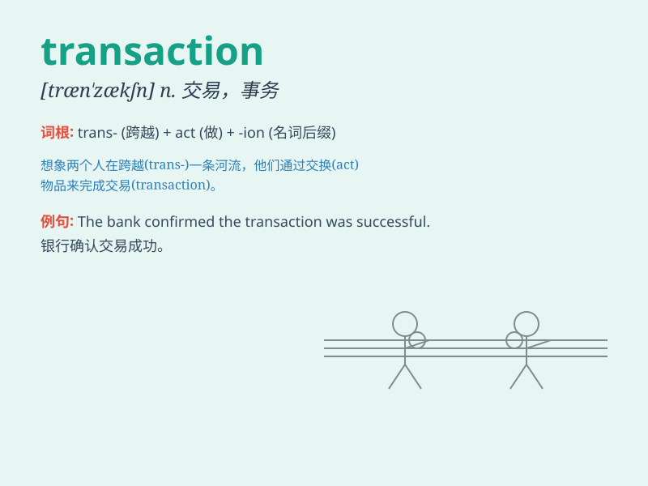

## transaction

**英音:** _[træn\'zækʃ(ə)n; trɑːn-; -\'sæk-]_ **美音:**
_[træn\'zækʃən]_

**译义:** *n.办理,处理,会报,学报,交易,事务,处理事务*

### 短语

+ **business transaction:** _商业交易_

+ **financial transaction:** _金融交易_

+ **commercial transaction:** _商业业务；商务交易_

+ **transaction cost:** _交易成本_

+ **transaction processing:** _事务处理_

### 例句

#### 例句1

> **The transaction was completed smoothly.**

**中文翻译:** 这笔交易顺利完成了。

**单词释义:** 交易

#### 例句2

> **He recorded every transaction in the ledger.**

**中文翻译:** 他把每笔交易都记录在分类账上。

**单词释义:** 交易；业务

#### 例句3

> **The bank charges a fee for each financial transaction.**

**中文翻译:** 银行对每笔金融交易收取费用。

**单词释义:** 交易；事务

### 背诵小故事

> A thief was caught in the act of a transaction. He was trying to sell
stolen jewels to a buyer. But the police showed up and stopped this
illegal transaction.

**一个小偷在进行交易时被当场抓获。他试图把偷来的珠宝卖给一个买家。但警察出现并阻止了这场非法交易。**

### 图义

