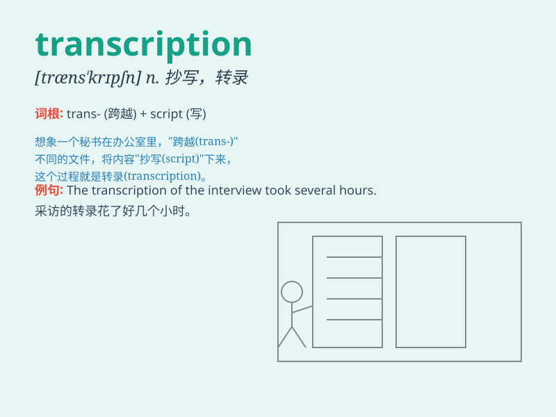

## transcription

**英音:** _[træn\'skrɪpʃ(ə)n; trɑːn-]_ **美音:**
_[træn\'skrɪpʃən]_

**译义:** *n.抄写,抄本*

### 短语

+ **genetic transcription:** _基因转录_

+ **transcription factor:** _转录因子_

+ **RNA transcription:** _RNA 转录_

+ **transcription error:** _转录错误_

+ **transcription process:** _转录过程_

### 例句

#### 例句1

> **The transcription of the meeting was very accurate.**

**中文翻译:** 这次会议的记录非常准确。

**单词释义:** 记录；抄本

#### 例句2

> **She is responsible for the transcription of audio files into
text.**

**中文翻译:** 她负责把音频文件转写成文本。

**单词释义:** 转写；转录

#### 例句3

> **The genetic transcription process is complex.**

**中文翻译:** 基因转录过程很复杂。

**单词释义:** 转录（遗传信息的）

### 背诵小故事

> A scientist was working hard on a mysterious project. He spent days
transcribing data from old manuscripts. The act of carefully writing
down the information was called transcription.

**一位科学家正在努力从事一个神秘的项目。他花了好几天时间从旧手稿中转录数据。这种仔细写下信息的行为就被称为转录。**

### 图义

