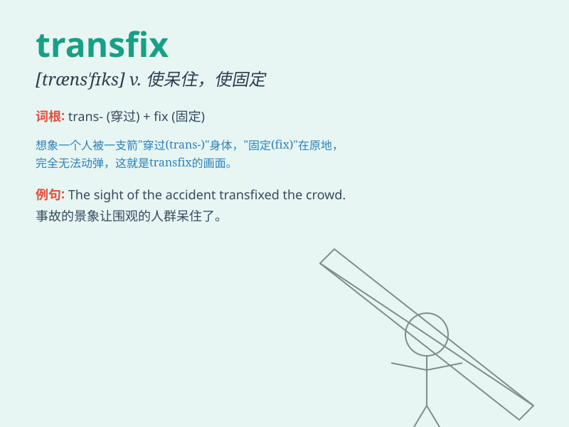

## transfix

**英音:** _[træns\'fɪks; trɑːns-; -nz-]_ **美音:**
_[træns\'fɪks]_

**译义:** *vt.刺穿,使呆住*

### 短语

+ **transfix with terror:** _因恐惧而呆住_

+ **transfix by surprise:** _因惊讶而愣住_

+ **transfix the enemy:** _使敌人动弹不得_

+ **transfix one\'s attention:** _吸引某人的注意力_

+ **be transfixed on something:** _全神贯注于某事_

### 例句

#### 例句1

> **The snake\'s gaze transfixed the little mouse.**

**中文翻译:** 蛇的目光惊呆了小老鼠。

**单词释义:** 使呆住；使动弹不得

#### 例句2

> **He was transfixed by the beauty of the landscape.**

**中文翻译:** 他被美丽的风景迷住了。

**单词释义:** 吸引住；迷住

#### 例句3

> **The horror on her face transfixed him.**

**中文翻译:** 她脸上的惊恐让他惊呆了。

**单词释义:** 使呆住；使惊恐

### 背诵小故事

> A brave knight was fighting in a battle. Suddenly, an enemy\'s arrow
transfixed his shield, making him unable to move. The image of that
arrow stuck in the shield helped him remember the word \'transfix\'.

**一位勇敢的骑士正在战斗。突然，敌人的一支箭刺穿了他的盾牌，使他无法动弹。那支箭扎在盾牌上的画面帮助他记住了'transfix（刺穿；使呆住）'这个单词。**

### 图义

