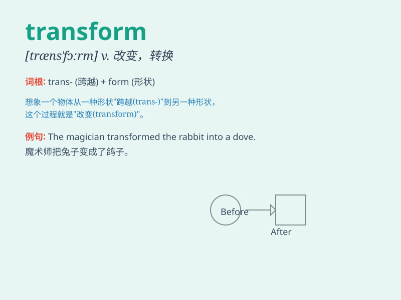

## transform

**英音:** _[træns\'fɔːm; trɑːns-; -nz-]_ **美音:**
_[træns\'fɔrm]_

**译义:**
*vt.转换,改变,改造,使\...变形vi.改变,转化,变换n.[数]变换(式),[语]转换*

### 短语

+ **transform into:** _变成；转变为_

+ **transform sth/sb from\...to\...:**
_把某物/某人从\...\...变成\...\..._

+ **transform A into B:** _把 A 变成 B_

+ **radical transform:** _彻底的变革_

+ **transform the situation:** _改变局面_

### 例句

#### 例句1

> **The company is transforming its business model to adapt to the
new market.**

**中文翻译:** 该公司正在转变其业务模式以适应新市场。

**单词释义:** 改变；转换

#### 例句2

> **A caterpillar transforms into a butterfly.**

**中文翻译:** 毛毛虫变成蝴蝶。

**单词释义:** 转变；变形

#### 例句3

> **The new technology has the potential to transform education.**

**中文翻译:** 新技术有潜力改变教育。

**单词释义:** 变革；使改观

### 背诵小故事

> Once upon a time, a plain old car was taken to a magic workshop. With
some special tools and skills, it was transformed into a shiny and fast
sports car. \'Transform\' means to change completely in form or
appearance.

**从前，有一辆普通的旧车被带到一个神奇的车间。通过一些特殊的工具和技能，它被彻底改变成了一辆闪亮且快速的跑车。'transform'意思是在形式或外表上完全改变。**

### 图义

