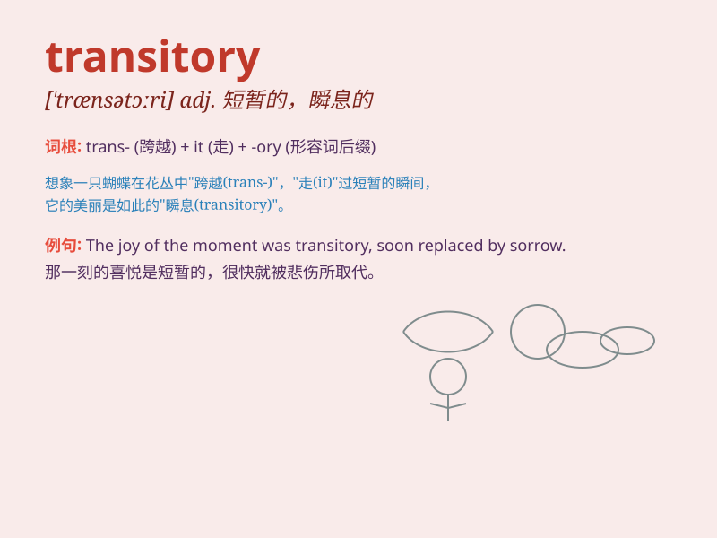

## transitory

**英音:** _[\'trænsɪt(ə)rɪ; \'trɑːns-; -nz-]_ **美音:**
_[\'trænsətɔri]_

**译义:** *adj.短时间的*

### 短语

+ **transitory period:** _过渡时期_

+ **transitory phenomenon:** _短暂现象_

+ **transitory stage:** _临时阶段_

+ **transitory nature:** _短暂的性质_

+ **transitory joy:** _短暂的快乐_

### 例句

#### 例句1

> **The joy of winning is often transitory.**

**中文翻译:** 胜利的喜悦往往是短暂的。

**单词释义:** 短暂的

#### 例句2

> **Our problems are transitory and will soon be solved.**

**中文翻译:** 我们的问题是暂时的，很快就会得到解决。

**单词释义:** 暂时的

#### 例句3

> **The transitory nature of the weather made it difficult to plan
outdoor activities.**

**中文翻译:** 天气的瞬息万变使得计划户外活动变得困难。

**单词释义:** 短暂多变的

### 背诵小故事

> A butterfly\'s life is transitory. It emerges beautifully from a
cocoon but has only a short time to fly and enjoy the world. Just like
many moments in our lives that pass quickly, being transitory and
fleeting.

**蝴蝶的生命是短暂的。它从茧中美丽地出现，但只有很短的时间飞翔和享受世界。就像我们生活中的许多瞬间，快速流逝，是短暂易逝的。**

### 图义

