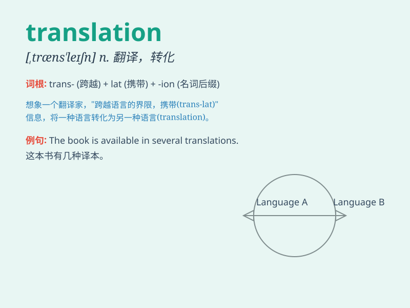

## translation

**英音:** _[træns\'leɪʃ(ə)n; trɑːns-; -nz-]_ **美音:**
_[træns\'leʃən]_

**译义:** *n.翻译,译文,转化,调任,转换[物][数]平移*

### 短语

+ **machine translation:** _机器翻译_

+ **literal translation:** _直译；逐字翻译_

+ **free translation:** _意译_

+ **translation memory:** _翻译记忆库_

+ **translation studies:** _翻译研究_

### 例句

#### 例句1

> **The translation of this book from French to English was very well
done.**

**中文翻译:** 这本书从法文到英文的翻译非常好。

**单词释义:** 翻译；译文

#### 例句2

> **I need a translation of this document for my meeting
tomorrow.**

**中文翻译:** 我需要翻译这份文件以供明天的会议使用。

**单词释义:** 翻译；译本

#### 例句3

> **The accuracy of the translation is crucial for international
communication.**

**中文翻译:** 翻译的准确性对于国际交流至关重要。

**单词释义:** 翻译

### 背诵小故事

>
有一天，小明在国外旅行，遇到一个当地人说了一堆话，他完全不懂。这时，一位好心的翻译出现，将那些话变成小明能懂的语言，这个过程就叫translation。

**有一天，小明在国外旅行，遇到当地人说话听不懂，这时一位好心的翻译出现，把当地人的话变成小明能懂的语言，这个过程就叫翻译。**

### 图义

